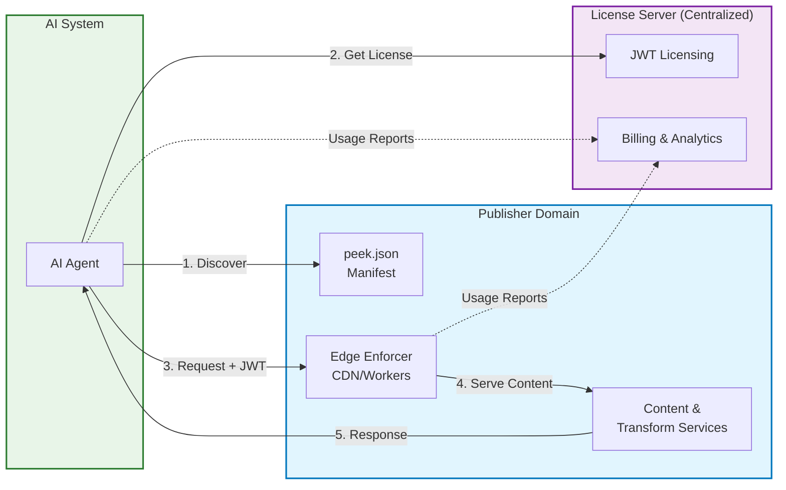

# Peek-Then-Pay JSON Specification

**Open standard bridging the AI-publisher divide — beyond scraping vs. paywalls to collaborative
value creation**

[](https://www.npmjs.com/package/@peekthenpay/peek-json-spec)
[](https://creativecommons.org/publicdomain/zero/1.0/)

This project is dedicated to the public domain under the CC0 1.0 Universal license.  
See [LICENSE](LICENSE) for details.


## Overview

**The AI ecosystem is at a crossroads.**  
Publishers want to protect and monetize their content,
while AI systems need contextual, real-time data. This tension has created a patchwork of paywalls,
lawsuits, and closed-door deals.

Peek-Then-Pay provides a better path: an **open standard for balanced collaboration**. Just as HTTP,
HTML, and robots.txt enabled the web to thrive through shared standards, we need consistent rules
for AI content access.

### The Problem: Two Broken Extremes

AI access to web content has polarized into unsustainable models:

1. **Unrestricted scraping** — disregards publisher rights and invites legal and ethical conflict.
2. **Restrictive walls and intermediaries** — from hard paywalls to centralized tollbooths, these block discovery, fragment ecosystems, and concentrate control.

Each side fails to provide a standardized, transparent, and enforceable path for responsible access.  
Publishers need control without isolation; AI systems need access without overreach.

### The Solution: Balanced Hybrid Model

Peek-Then-Pay bridges this gap with **clear separation of responsibilities**:

**Decentralized where it matters:**

- Publishers advertise terms in standardized `peek.json` manifests
- Publishers enforce policies at their own edge (CDN/Workers)
- Publishers control content transformation and tooling

**Centralized where it helps:**

- Common licensing marketplace handles payments and accounts
- Unified integration path for AI systems across publishers
- Standardized intent-based pricing and contracts

**Result:**
AI agents can:

1. **Preview content** to evaluate value
2. **Choose specific usage types** (read, summarize, embed, etc.)
3. **Access clean, context-aware data** — publishers provide accurate transforms that save cost and time

## Key Features

- **👁️ Content Peek** - "Preview" model for informed licensing decisions
- **🎯 Intent-Based Pricing** - Pay for specific transformations (summarize, embed, translate)
- **🔐 Unified Licensing** - Single JWT-based system works across all participating publishers
- **⚡ Edge Enforcement** - Fast, distributed license validation at CDN/edge layer
- **📊 Bilateral Reporting** - Both parties track usage for accuracy and dispute resolution
- **🔧 Composable Tooling** - Optional content transformation services

## How It Works

1. **Discovery** - Publishers serve `/.well-known/peek.json` manifests with licensing terms
2. **Preview** - License-gated content returns 203 + content preview + pricing options
3. **License** - AI agents acquire JWT licenses for specific usage contexts from License Server
4. **Access** - Edge enforcers validate assertion-only JWTs and manage budgets locally without
   requiring License Server connectivity
5. **Report** - Both parties report usage asynchronously for billing and dispute resolution

## Why HTTP 203 for Previews?

The specification uses **HTTP 203 "Non-Authoritative Information"** for content previews, which
offers significant advantages over traditional payment walls:

**🤖 Better for AI Systems & Crawlers:**

- Most AI systems process 203 responses normally (unlike 402 which is often blocked)
- Search engines and semantic crawlers can index preview content for discovery
- Agents can make informed licensing decisions based on actual content samples
- No need for special error handling - preview content flows through standard pipelines

**📈 Better for Publishers:**

- Higher engagement rates as AI systems actually see and evaluate content
- Natural content discovery through preview snippets appearing in AI responses
- Builds trust through transparency rather than blind payment walls
- Enables value-based pricing decisions (agents see quality before licensing)

**🎯 Semantic Accuracy:**

- 203 correctly indicates "partial information provided" rather than "access denied"
- Previews ARE content (not errors), just not the complete authoritative version
- Aligns with web standards for partial/cached/proxy responses

This approach transforms licensing from a barrier into a **discovery and value demonstration tool**.

## Standard Intents

| Intent       | Purpose                            | Typical Use                        |
| ------------ | ---------------------------------- | ---------------------------------- |
| `peek`       | Content preview                    | Discovery, preview                 |
| `read`       | Full content                       | Training, analysis                 |
| `summarize`  | Content summary                    | Context building                   |
| `quote`      | Verbatim excerpts                  | Citations, previews                |
| `embed`      | Vector embeddings                  | RAG, similarity search             |
| `translate`  | Language translation               | Multilingual content               |
| `analyze`    | Structured analysis                | Content classification             |
| `qa`         | Question answering                 | Information extraction             |
| `search`     | Discovery across publisher catalog | Content discovery, filtering       |
| `rag_ingest` | Batch export for RAG systems       | Training data, persistent indexing |

**Note:** `search` and `rag_ingest` operate via dedicated endpoints (not per-URL requests) and work
across multiple resources in a publisher's catalog.

## Architecture



**Key Characteristics:**

- **Autonomous Edge Enforcement**: Validates assertion-only JWTs without License Server dependency
- **Decentralized Control**: Publishers maintain authority at their domain edge
- **Centralized Coordination**: Unified licensing and billing across all publishers
- **Bilateral Reporting**: Both parties report usage for accuracy and dispute resolution

## Edge Runtime Compatibility

This package is **fully optimized for edge runtimes** including Cloudflare Workers, Vercel Edge Functions, and other V8-based environments:

- ✅ **Pre-compiled Validators** - No runtime AJV dependency or schema compilation
- ✅ **Zero Node.js APIs** - Pure JavaScript with Web Standard APIs only
- ✅ **Minimal Bundle Size** - Tree-shakable imports and optimized for edge constraints
- ✅ **Cold Start Optimized** - Instant validation with no initialization overhead

```typescript
// Edge-compatible validation example
import ptpSummarizeValidator from '@peekthenpay/peek-json-spec/validators/ptp-summarize-validator.js';

// Works instantly in any edge runtime
const isValid = ptpSummarizeValidator(responseData);
```

## Documentation

| Document                                                                   | Purpose                                                                                                                                                                                                            | Status        |
| -------------------------------------------------------------------------- | ------------------------------------------------------------------------------------------------------------------------------------------------------------------------------------------------------------------ | ------------- |
| [**Intent Definitions**](./docs/normative-intent-definitions.md)           | **Core specification defining standard AI interaction patterns** (read, summarize, embed, etc.), usage contexts, attribution requirements, and JWT security implementation. Required reading for all implementers. | **Normative** |
| [**Manifest Fields**](./docs/peek-manifest-fields.md)                      | **Complete peek.json reference** with field definitions, validation rules, and schema compliance requirements. Essential for publishers setting up content licensing terms.                                        | **Normative** |
| [**Validation Utilities**](./docs/validation-utilities.md)                 | **Technical reference for validation functions** including edge-compatible pre-compiled validators, factory functions, and schema validation patterns for all Peek-Then-Pay components.                            | **Reference** |
| [**License API**](./docs/license-api.md)                                   | **Complete API specification** for license acquisition, validation, and usage reporting. Covers JWT workflows, bilateral reporting, and edge enforcement integration patterns.                                     | Informative   |
| [**Bot Detection Guidance**](./docs/bot-detection-guidance.md)             | **Publisher guidance for AI agent detection and licensing discovery** with Schema.org structured data patterns, auto-peek vs. non-auto-peek publisher strategies, and machine-readable licensing metadata.         | Recommended   |
| [**Edge Enforcement Guide**](./docs/recommended-edge-enforcement-guide.md) | **Implementation patterns and architecture** for publishers deploying edge enforcement via CDNs, Workers, and bot detection services.                                                                              | Recommended   |

## Benefits

### For Publishers

- **Stay in Control** — Enforce access policies directly at your domain edge (via Workers/CDNs),
  without ceding content to third-party proxies
- **Simple Monetization** — Define pricing once, and rely on a central License Server to manage
  payments and operator accounts
- **AI-Ready by Default** — Provide optional transforms (summarization, embed, analyze) so your
  content is consistently represented in AI systems
- **Extend Your Reach** — Smaller publishers gain visibility in a shared marketplace, surfacing in
  AI discovery where they might otherwise be missed
- **Brand Integrity** — Ensure that when your content is summarized, ingested, or used in AI
  contexts, it reflects your voice and standards
- **Monetize Existing AI Investments** — Publishers already create embeddings for on-site
  search/chat; licensed access distributes costs across multiple AI systems
- **Value-Aligned Pricing** — Charge based on what agents actually receive (structured data,
  embeddings) rather than arbitrary "page access"

### For AI Systems & Agents

- **Unified Access** — Discover participating publishers automatically through `peek.json` manifests
- **One Integration, Many Publishers** — Acquire licenses and handle payments centrally, without
  negotiating with thousands of sites individually
- **Lower Compute Costs** — Use publisher-provided search, summarization, and transforms to avoid
  expensive, repeated crawling and context building
- **Structured Contracts** — Operate within a clear legal and technical framework, reducing risk and
  improving compliance
- **Extensible Tooling** — Access publisher-defined tools (via REST or MCP) for specialized use
  cases (training ingestion, semantic search, etc.)
- **Clear Value Pricing** — Pay for specific transformations (summarization, embeddings) rather than
  ambiguous "content access"
- **Pre-processed Data** — Receive clean, structured data instead of raw HTML parsing and
  transformation

### Economic Win-Win

- **Shared Infrastructure Costs** — One embedding computation serves multiple licensed AI agents vs.
  each agent computing separately
- **CPU/Time Savings** — AI systems avoid expensive content processing while publishers monetize
  their existing AI infrastructure
- **Access to Publisher Investments** — Leverage embeddings and preprocessing publishers already
  create for their own AI features

## Contributing

This is an open standard developed collaboratively:

- 📋 [Propose specification changes](https://github.com/PeekThenPay/peek-json-spec/issues)
- 🛠️ [Build reference implementations](https://github.com/PeekThenPay/peek-json-spec/pulls)
- 📖 [Improve documentation](https://github.com/PeekThenPay/peek-json-spec/tree/main/docs)
