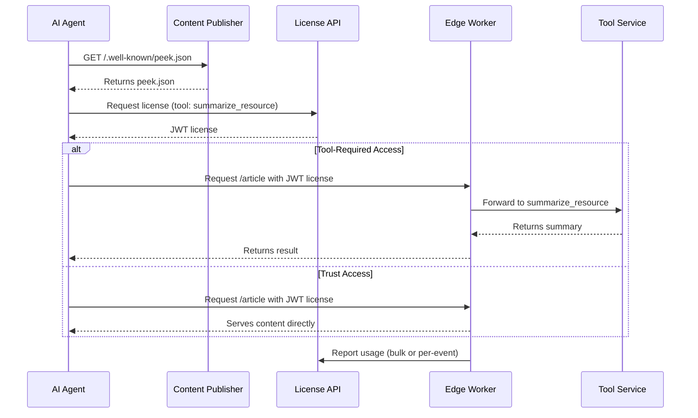

# peek.json: A Standard for Fair AI Access to Web Content

**A modern, assertion-only spec for structured, enforceable AI-web interaction.**

`peek.json` is a web-native standard for exposing structured access policies to AI agents. It enables publishers to declare preview capabilities, monetize content use, and guide AI systems toward licensed access—evolving the spirit of `robots.txt` for the AI era.

This repository defines the **peek.json schema** and **associated conventions** for the ecosystem, including AI crawler expectations, tool usage patterns, and licensing flows. All API and implementation details are documented in dedicated files:

- [`packages/spec/docs/license-api.md`](./packages/spec/docs/license-api.md) — License API reference
- [`packages/spec/docs/tool-service-api.md`](./packages/spec/docs/tool-service-api.md) — Tool service API reference

---

## 📦 What's in This Repository

- 📐 **JSON Schema** — The formal specification for `peek.json`
- 🛠 **Reference Types** — TypeScript interfaces for license API and tool service contracts
- 📘 **Documentation** — Use cases, architecture diagrams, and flow explanations
- 🧪 **Examples** — Example `peek.json` files and enforcement patterns

---

## 🧭 Role of peek.json in the Ecosystem

peek.json is **not an enforcer**, **not a paywall**, and **not a SaaS platform**. It is a machine-readable declaration of access terms (`/.well-known/peek.json`) that enables intent-based access control, hints to compatible license/tool APIs, and efficiency hints for AI systems. It defines the shared contract between publishers and AI agents.

## 🧱 Key Design Goals

- ✅ **Open and interoperable** — Works with any CDN, enforcement layer, or licensing provider
- ✅ **Declarative and discoverable** — Crawlable via `/.well-known/peek.json` or returned in 402s
- ✅ **Intent-aware** — Supports nuanced, intent-based pricing and enforcement
- ✅ **Modular** — Schema supports integration with licensing APIs, preview tooling, and rate-limited enforcement
- ✅ **Compatible with robots.txt** — Complements robots.txt for structured LLM access

---

## ✨ Key Concepts

### Tools (Intent Categories)

| Tool Name             | Purpose                         | Example Use Case          |
| --------------------- | ------------------------------- | ------------------------- |
| `peek_resource`       | Lightweight preview             | Link discovery            |
| `summarize_resource`  | Generate summary                | News aggregation          |
| `quote_resource`      | Allow attribution snippets      | Citation in chatbots      |
| `generate_embeddings` | Vectorize for semantic indexing | Site-wide search          |
| `rag_query`           | Chunking for knowledge agents   | RAG pipeline ingestion    |
| `read_resource`       | Serve full content              | Inference, summarization  |
| `train_on_resource`   | Use in model training           | Foundation model training |

---

## 🧾 peek.json Structure

Served at: `/.well-known/peek.json`
Example:

```json
{
  "version": "1.0",
  "meta": {
    "site_name": "TechNews Daily",
    "domains": ["technews.com"],
    "categories": ["technology", "news"],
    "last_updated": "2025-08-04"
  },
  "license": {
    "license_issuer": "https://api.technews.com/peek/license"
  },
  "enforcement": {
    "failover_mode": "deny"
  },
  "content_hints": {
    "average_page_size_kb": 32,
    "content_types": ["text/html", "application/json"],
    "update_frequency": "daily",
    "cache_duration": 3600
  }
}
```

---

## 🔐 License Flows

peek.json supports assertion-only licensing: all licenses are signed JWTs with embedded quota and pricing. Edge enforcers validate JWTs and enforce quotas locally, reporting usage in bulk or per-event. See [`packages/spec/docs/license-api.md`](./packages/spec/docs/license-api.md) for full API details.

**Tool support, pricing, and enforcement details are not declared in peek.json.**
These are managed by the publisher in the license server and returned to AI agents via the license API (`/pricing` endpoint) for each publisher/account. AI agents must query the license API to discover available tools, pricing, and enforcement models.

---

## 🚦 Access & Enforcement Flow

peek.json enables a standardized flow for AI agents to access publisher content:

**Discovery**

- The AI agent requests `/.well-known/peek.json` from the publisher's site.
- If the agent is detected as a bot and does not provide a valid license, the edge enforcer responds with HTTP 402 (Payment Required), including both the peek.json manifest and a free `peek_resource` preview.

**License Acquisition**

- The AI agent reviews the peek.json manifest to understand available tools/intents and licensing requirements.
- The agent contacts the license server (endpoint provided in peek.json) to acquire a license for the desired tools/intents.

**Content Request & Enforcement**

- The AI agent requests content from the publisher, presenting its license token.
- The edge enforcer validates the license and enforces the appropriate access mode:
  - **Tool-required**: The enforcer routes the request to the publisher’s tool service for processing (e.g., summarization).
  - **Trust**: The enforcer serves raw content directly if the license allows.
  - **Both**: The agent can choose between raw or processed content, as permitted by the license.

**Usage Reporting**

- The edge enforcer reports usage to the license server, updating quotas and spend.

See the End-to-End Flow Diagram below for a visual overview.

---

## 🌐 Intended Implementations

peek.json is designed to work with edge/CDN enforcers that may be:

- Deployed by the **publisher** (self-hosted enforcement)
- Provided via **SaaS** (e.g., FetchRight)
- Backed by **license brokers** and **tool services**

---

## 📚 Reference Materials

- [`packages/spec/docs/robots-to-peek.md`](./packages/spec/docs/robots-to-peek.md) — Robots.txt to peek.json evolution
- [`packages/spec/docs/peek-manifest-fields.md`](./packages/spec/docs/peek-manifest-fields.md) — Manifest field reference
- [`packages/spec/examples/peek.json`](./packages/spec/examples/peek.json) — Starter file for publishers
- [`packages/spec/docs/license-api.md`](./packages/spec/docs/license-api.md) — License API reference
- [`packages/spec/docs/tool-service-api.md`](./packages/spec/docs/tool-service-api.md) — Tool service API reference
- [`packages/spec/docs/recommended-edge-enforcement-guide.md`](./packages/spec/docs/recommended-edge-enforcement-guide.md) — CDN enforcement checklist

---

## 🧠 Why This Matters

- **For Publishers**: Clear monetization rules, transparency for AI use, preview exposure
- **For AI Crawlers**: Standard discovery, transparent licensing, better agent UX
- **For the Web**: A shared standard for the AI age, evolving the spirit of `robots.txt` for commercial LLMs

---

## 🔄 End-to-End Flow Diagram (Mermaid)


