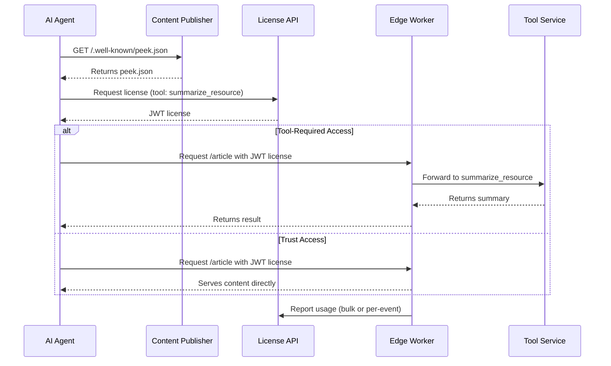

# peek.json: A Standard for Fair AI Access to Web Content

**A modern, assertion-only spec for structured, enforceable AI-web interaction.**

`peek.json` is a web-native standard for exposing structured access policies to AI agents. It enables publishers to declare preview capabilities, monetize content use, and guide AI systems toward licensed access—evolving the spirit of `robots.txt` for the AI era.

This repository defines the **peek.json schema** and **associated conventions** for the ecosystem, including AI crawler expectations, tool usage patterns, and licensing flows. All API and implementation details are documented in dedicated files:

- [`docs/license-api.md`](./docs/docs/license-api.md) — License API reference
- [`docs/tool-service-api.md`](./docs/docs/tool-service-api.md) — Tool service API reference

---

## 📦 What's in This Repository

- 📐 **JSON Schema** — The formal specification for `peek.json`
- 🛠 **Reference Types** — TypeScript interfaces for license API and tool service contracts
- 📘 **Documentation** — Use cases, architecture diagrams, and flow explanations
- 🧪 **Examples** — Example `peek.json` files and enforcement patterns

---

## 🧭 Role of peek.json in the Ecosystem

peek.json is **not an enforcer**, **not a paywall**, and **not a SaaS platform**. It defines:

- A **machine-readable declaration** of access terms (`/.well-known/peek.json`)
- Support for **intent-based access control** (e.g., `summarize_resource`, `embed`, `read_resource`, `train_on_resource`)
- Hints to compatible **license APIs** and **tool service endpoints**
- Efficiency hints for AI systems (via `content_hints` in peek.json)
- The shared contract between **publishers** and **AI agents**

---

## 🧱 Key Design Goals

- ✅ **Open and interoperable** — Works with any CDN, enforcement layer, or licensing provider
- ✅ **Declarative and discoverable** — Crawlable via `/.well-known/peek.json` or returned in 402s
- ✅ **Intent-aware** — Supports nuanced, intent-based pricing and enforcement
- ✅ **Modular** — Schema supports integration with licensing APIs, preview tooling, and rate-limited enforcement
- ✅ **Compatible with robots.txt** — Complements robots.txt for structured LLM access

---

## ✨ Key Concepts

### Tools (Intent Categories)

| Tool Name             | Purpose                         | Example Use Case          |
| --------------------- | ------------------------------- | ------------------------- |
| `peek_resource`       | Lightweight preview             | Link discovery            |
| `summarize_resource`  | Generate summary                | News aggregation          |
| `quote_resource`      | Allow attribution snippets      | Citation in chatbots      |
| `generate_embeddings` | Vectorize for semantic indexing | Site-wide search          |
| `rag_query`           | Chunking for knowledge agents   | RAG pipeline ingestion    |
| `read_resource`       | Serve full content              | Inference, summarization  |
| `train_on_resource`   | Use in model training           | Foundation model training |

---

## 🧾 peek.json Structure

Served at: `/.well-known/peek.json`
Defines:

- `meta`: Domain metadata
- `license`: Licensing provider (only the endpoint and terms, not tool/pricing details)
- `enforcement`: Optional bot detection hints
- `content_hints`: Optional efficiency hints for AI systems (e.g., average page size, content types, update frequency)

**Note:** Tool support, pricing, and enforcement details are managed by the publisher in the license server (SaaS UI) and are returned dynamically via the license API. They are not part of the peek.json manifest.

Example:

```json
{
  "version": "1.0",
  "meta": {
    "site_name": "TechNews Daily",
    "domains": ["technews.com"],
    "categories": ["technology", "news"],
    "last_updated": "2025-08-04"
  },
  "license": {
    "license_issuer": "https://api.technews.com/peek/license"
  },
  "enforcement": {
    "failover_mode": "deny"
  },
  "content_hints": {
    "average_page_size_kb": 32,
    "content_types": ["text/html", "application/json"],
    "update_frequency": "daily",
    "cache_duration": 3600
  }
}
```

---

## 🔐 License Flows

peek.json supports assertion-only licensing: all licenses are signed JWTs with embedded quota and pricing. Edge enforcers validate JWTs and enforce quotas locally, reporting usage in bulk or per-event. See [`docs/license-api.md`](./docs/docs/license-api.md) for full API details.

**Tool support, pricing, and enforcement details are not declared in peek.json.**
These are managed by the publisher in the license server and returned to AI agents via the license API (`/pricing` endpoint) for each publisher/account. AI agents must query the license API to discover available tools, pricing, and enforcement models.

---

## 🚦 Access & Enforcement Flows

1. **Discovery**: AI agent requests `/.well-known/peek.json` or receives it via `402 Payment Required`
2. **License Acquisition**: AI agent contacts the license server for supported tools
3. **Usage Enforcement**:

- Tool-required → Edge enforcer calls publisher’s tool service
- Trust → Edge enforcer serves raw content
- Both → AI agent chooses preferred mode

---

## 🌐 Intended Implementations

peek.json is designed to work with edge/CDN enforcers that may be:

- Deployed by the **publisher** (self-hosted enforcement)
- Provided via **SaaS** (e.g., FetchRight)
- Backed by **license brokers** and **tool services**

See [`peek-core-enforcer`](https://github.com/PeekThenPay/peek-core-enforcer) for shared enforcement logic.

---

## 📚 Reference Materials

- [`docs/field-reference.md`](./docs/field-reference.md) — All schema fields
- [`docs/license-api.md`](./docs/docs/license-api.md) — License API reference
- [`docs/tool-service-api.md`](./docs/docs/tool-service-api.md) — Tool service API reference
- [`docs/enforcement-guide.md`](./docs/enforcement-guide.md) — CDN enforcement examples
- [`examples/peek.json`](./examples/peek.json) — Starter file for publishers

---

## 🧠 Why This Matters

- **For Publishers**: Clear monetization rules, transparency for AI use, preview exposure
- **For AI Crawlers**: Standard discovery, transparent licensing, better agent UX
- **For the Web**: A shared standard for the AI age, evolving the spirit of `robots.txt` for commercial LLMs

---

## 🤝 Join the Ecosystem

Want to integrate peek.json?  
Start by adding a `/.well-known/peek.json` file to your site and referencing our example schemas.

Looking to build enforcers, license servers, or tool services?  
Contribute to [`peek-core-enforcer`](https://github.com/PeekThenPay/peek-core-enforcer) or join the community via [PeekThenPay](https://github.com/PeekThenPay).

---

## 🔄 End-to-End Flow Diagram (Mermaid)


