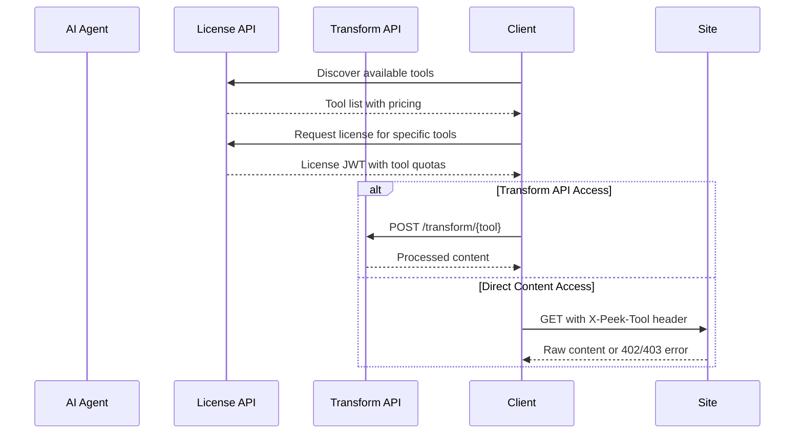

# Peek-Then-Pay: The AI Era Evolution of robots.txt

# Peek-Then-Pay: MCP with Fair Usage Licensing

Peek-Then-Pay extends the Model Context Protocol (MCP) to enable fair, transparent licensing between content servers and AI clients. Building on the 31-year legacy of robots.txt, this standard allows MCP servers to define usage-based access policies and pricing for AI clients based on their intended use of resources.

This repository defines the `peek.json` manifest format and associated license acquisition flow, enabling AI clients to discover server capabilities, request specific resource access patterns, and pay only for what they use—enforced at the resource level with capability-specific pricing.

Just as robots.txt enabled websites to communicate crawling preferences to search engines in 1994, Peek-Then-Pay enables fair and equitable engagement between MCP servers and AI clients in 2025—moving beyond simple "allow/disallow" to nuanced, value-based access control.

## 🤝 From robots.txt to MCP with Fair Usage

| Era | Standard | Purpose | Control Level |
|-----|----------|---------|---------------|
| **1994-2025** | `robots.txt` | Search engine crawling | Binary allow/disallow |
| **2024+** | `MCP` | AI context & tool access | Capability-based |
| **2025+** | `Peek-Then-Pay` | MCP + fair usage licensing | Resource-based with pricing |

### The robots.txt Legacy
```
# robots.txt - Binary control
User-agent: *
Disallow: /private/
Allow: /public/
```

### The Peek-Then-Pay Evolution
```json
// peek.json - Nuanced, value-based control
{
  "license": {
    "tools": {
      "peek_resource": {"allowed": true, "license_required": false},
      "summarize_resource": {"allowed": true, "pricing": {"default_per_page": 0.02}},
      "train_on_resource": {"allowed": false}
    }
  }
}
```

## 🎯 Fair & Equitable AI Engagement

**For MCP Servers (like robots.txt did for webmasters):**
- 🏛️ **Sovereign control** over how AI systems use their content
- 💰 **Fair compensation** for value-generating AI use cases
- 🎯 **Granular permissions** beyond binary allow/disallow
- 📊 **Transparent pricing** that scales with usage value

**For MCP Clients (like search crawlers):**
- 🔍 **Clear discovery** of access rules via standardized manifest
- 💡 **Predictable costs** before accessing content
- ⚡ **Optimized content** via tool-specific transforms
- 🤖 **Respectful behavior** through standardized protocols

**For the Web Ecosystem:**
- 🌐 **Universal standard** for AI content engagement
- ⚖️ **Balanced power** between content creators and AI systems
- 🚀 **Innovation enablement** through clear, fair rules
- 📈 **Sustainable growth** of AI while rewarding content creators

## 🎯 MCP-Compatible Resource Access Control

- **Tool-based pricing**: Different costs for peek, summarize_resource, generate_embeddings, etc.
- **Capability permissions**: Servers can allow/deny specific tools and resource access patterns
- **Licensed capabilities**: AI clients acquire licenses for specific server capabilities
- **Resource transformation tools**: Standardized MCP tools for content processing
- **Edge-ready**: Designed for CDNs, reverse proxies, and modern caching strategies

## 🛠️ Supported Tools & Capabilities

| Tool Name | Description | Typical Use Case |
|-----------|-------------|------------------|
| **peek_resource** | Short previews | Quick content discovery |
| **quote_resource** | Quotable excerpts | Attribution and referencing |
| **get_metadata** | Structured metadata | Content categorization |
| **summarize_resource** | AI-generated summaries | Content understanding |
| **generate_embeddings** | Vector embeddings | Semantic search |
| **prepare_for_rag** | RAG-optimized chunks | Knowledge retrieval |
| **read_resource** | Complete content | Direct consumption |
| **index_resource** | Search optimization | Discovery systems |
| **training** | Model training data | AI model improvement |

## 📄 `peek.json` Manifest (MCP Server Configuration)

Like robots.txt at `/robots.txt`, the `peek.json` file is served from `/.well-known/peek.json` and includes:

- **`capabilities`** – MCP-compatible server capabilities with licensing extensions
- **`license`** – License acquisition endpoint and tool-based access policies

### robots.txt → MCP + Peek-Then-Pay Evolution

**Where robots.txt stops:**
```
User-agent: GPTBot
Disallow: /
```
*"You can't access anything"*

**Where MCP + Peek-Then-Pay begins:**
```json
{
  "capabilities": {
    "resources": {"subscribe": true, "listChanged": true},
    "tools": {"listChanged": true},
    "licensing": {"usage_based": true}
  },
  "license": {
    "tools": {
      "peek_resource": {"allowed": true, "license_required": false},
      "quote_resource": {"allowed": true, "restrictions": {"attribution_required": true}},
      "summarize_resource": {"allowed": true, "pricing": {"default_per_call": 0.02}},
      "train_on_resource": {"allowed": false}
    }
  }
}
```
*"Here are my MCP capabilities, here's how you can use them, and here's what it costs"*

Example:
```json
{
  "version": "1.0",
  "meta": {
    "site_name": "TechNews Daily",
    "publisher": "TechNews Corp",
    "categories": ["technology", "news", "reviews"],
    "last_updated": "2025-08-01"
  },
  "license": {
    "license_issuer": "https://api.technews.com/peek/license",
    "transform_api": "https://api.technews.com/peek/transform",
    "terms_url": "https://technews.com/legal/ai-terms",
    "global_pricing": {
      "currency": "USD",
      "override_mechanism": "both"
    },
    "tools": {
      "peek_resource": {
        "allowed": true,
        "license_required": false,
        "output_formats": ["plaintext", "html"]
      },
      "summarize_resource": {
        "allowed": true,
        "pricing": {
          "default_per_page": 0.02,
          "max_per_page": 0.10
        },
        "license_required": true,
        "output_formats": ["markdown", "json"],
        "restrictions": {
          "attribution_required": true,
          "commercial_use": true
        }
      },
      "train_on_resource": {
        "allowed": false
      }
    }
  }
}
```

## 🚦 Tool-Based License Flow



1. **Tool Discovery**: MCP client discovers available tools and pricing
2. **License Request**: MCP client requests license for specific tools with quotas
3. **Content Access**: MCP client accesses content via transform API or direct headers
4. **Usage Tracking**: System tracks usage per tool and enforces quotas

## 🔄 Transform API

The transform API provides standardized, tool-specific content processing:

- **`POST /transform/peek`** → Brief content previews
- **`POST /transform/summarization`** → AI-generated summaries  
- **`POST /transform/embedding`** → Vector embeddings
- **`POST /transform/rag`** → RAG-optimized content chunks
- **`POST /transform/full_access`** → Complete formatted content

## 📚 Documentation

- [`docs/overview.md`](./docs/overview.md) – Conceptual overview
- [`docs/field-reference.md`](./docs/field-reference.md) – Complete field specification
- [`docs/license-api.md`](./docs/license-api.md) – License acquisition API with Mermaid diagrams
- [`docs/transform-api.md`](./docs/transform-api.md) – Content transformation API specification
- [`examples/peek.json`](./examples/peek.json) – Complete example manifest

## 🏗️ Project Structure

```
schema/
└── peek.schema.json          # JSON Schema definition

docs/
├── overview.md              # High-level concepts
├── field-reference.md       # Detailed field documentation  
├── license-api.md          # License API with flow diagrams
└── transform-api.md        # Transform API specification

examples/
└── peek.json               # Example peek.json with all tools
```

## 🌍 Benefits: Building on robots.txt's Foundation

**For MCP Servers (Webmasters in the AI Era):**
- 🎛️ **Granular control** over AI content usage (vs. robots.txt's binary allow/disallow)
- 💰 **Fair monetization** of high-value AI use cases like training and embeddings
- 🏷️ **Clear attribution policies** and commercial use restrictions
- 🔌 **Standardized integration** that works with existing web infrastructure
- 📊 **Usage transparency** and quota management

**For MCP Clients (Search Crawlers of the AI Era):**
- 🗺️ **Transparent discovery** of access rules (like robots.txt, but richer)
- 💸 **Predictable pricing** before content access
- ⚡ **Optimized content delivery** via intent-specific transforms
- 🤝 **Respectful protocols** that honor publisher preferences
- 📈 **Scalable quota management** across multiple sites

**For the Web Ecosystem:**
- 🌐 **Universal protocol** for AI-web interaction (robots.txt successor)
- ⚖️ **Power balance** between content creators and AI systems
- 🚀 **Innovation catalyst** through clear, fair engagement rules
- 💡 **Sustainable AI development** that rewards content creators
- 🔗 **Web-native implementation** using existing HTTP and CDN infrastructure

## 🔗 Integration with Existing Web Standards

Peek-Then-Pay builds on familiar web patterns:

```
yoursite.com/
├── robots.txt              # Traditional crawler rules
├── sitemap.xml            # Content discovery
├── .well-known/
│   ├── peek.json          # AI access policies
│   └── peek-license.json  # Legal terms
└── api/
    ├── peek/
    │   ├── license        # License acquisition
    │   └── transform      # Content processing
    └── content/           # Your existing content
```

**Familiar Implementation Patterns:**
- **Discovery**: Like robots.txt, automatically checked by AI agents
- **Enforcement**: HTTP status codes (402, 403) like existing web auth
- **Edge Processing**: CDN/Worker integration like modern web apps
- **Standards Compliance**: JSON Schema validation like OpenAPI specs
