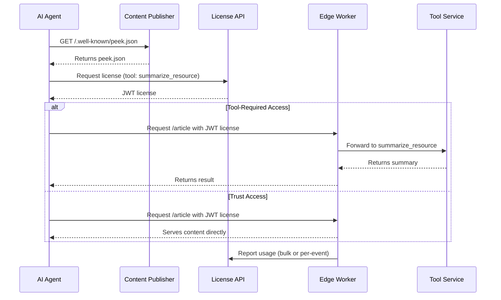

# peek.json Specification

**A modern successor to robots.txt for AI-web interaction**

## Overview

`peek.json` is a proposed web standard that evolves the spirit of `robots.txt` for the AI era. While
`robots.txt` provides basic crawling directives, `peek.json` enables structured, intent-based access
policies for AI agents interacting with web content.

This repository contains:

1. The formal **peek.json specification**
2. The official **JSON Schema** definition
3. Supporting documentation and examples
4. Reference implementation tools

## Why peek.json?

As AI systems increasingly interact with web content, we need a standard that goes beyond simple
allow/deny rules:

- ✅ **Intent-Based Access** - Different permissions for different AI uses (preview, summarize,
  train)
- ✅ **Structured Policies** - Machine-readable declarations of access terms
- ✅ **Fair Use Framework** - Clear paths for commercial AI systems to respect publisher wishes
- ✅ **Discoverable** - Standard location at `/.well-known/peek.json`
- ✅ **Backwards Compatible** - Works alongside existing `robots.txt`

## Core Specification

The peek.json specification consists of:

- [`schema/peek.schema.json`](./schema/peek.schema.json) - The normative JSON Schema definition
- [`docs/peek-manifest-fields.md`](./docs/peek-manifest-fields.md) - Detailed field reference
- [`examples/peek.json`](./examples/peek.json) - Example implementation

## Implementation Resources

To help adoption of the peek.json specification, this repository includes:

### TypeScript Types

TypeScript interfaces for implementing the specification:

```typescript
import { PeekManifest } from '@peekthenpay/peek-json-spec';
```

### Validation Tools

Tools for validating peek.json files against the specification:

```javascript
import { validatePeekJson } from '@peekthenpay/peek-json-spec/validation';
```

### Additional Documentation

- [`docs/robots-to-peek.md`](./docs/robots-to-peek.md) - Migration guide from robots.txt
- [`docs/license-api.md`](./docs/license-api.md) - License API implementation guide
- [`docs/tool-service-api.md`](./docs/tool-service-api.md) - Tool service API guide
- [`docs/recommended-edge-enforcement-guide.md`](./docs/recommended-edge-enforcement-guide.md) -
  Implementation guide

## Repository Structure

```
peek-json-spec/
├── schema/                 # Official JSON Schema definition
├── docs/                   # Specification documentation
├── examples/              # Example implementations
└── src/                   # Reference implementation tools
    ├── types/            # TypeScript interfaces
    └── validation/       # Schema validation utilities
```

---

## 🧭 Role of peek.json in the Ecosystem

peek.json is **not an enforcer**, **not a paywall**, and **not a SaaS platform**. It is a
machine-readable declaration of access terms (`/.well-known/peek.json`) that enables intent-based
access control, hints to compatible license/tool APIs, and efficiency hints for AI systems. It
defines the shared contract between publishers and AI agents.

## 🧱 Key Design Goals

- ✅ **Open and interoperable** — Works with any CDN, enforcement layer, or licensing provider
- ✅ **Declarative and discoverable** — Crawlable via `/.well-known/peek.json` or returned in 402s
- ✅ **Intent-aware** — Supports nuanced, intent-based pricing and enforcement
- ✅ **Modular** — Schema supports integration with licensing APIs, preview tooling, and
  rate-limited enforcement
- ✅ **Compatible with robots.txt** — Complements robots.txt for structured LLM access

---

## ✨ Key Concepts

### Tools (Intent Categories)

| Tool Name             | Purpose                         | Example Use Case          |
| --------------------- | ------------------------------- | ------------------------- |
| `peek_resource`       | Lightweight preview             | Link discovery            |
| `summarize_resource`  | Generate summary                | News aggregation          |
| `quote_resource`      | Allow attribution snippets      | Citation in chatbots      |
| `generate_embeddings` | Vectorize for semantic indexing | Site-wide search          |
| `rag_query`           | Chunking for knowledge agents   | RAG pipeline ingestion    |
| `read_resource`       | Serve full content              | Inference, summarization  |
| `train_on_resource`   | Use in model training           | Foundation model training |

---

## Specification Example

The peek.json file is served at `/.well-known/peek.json` and follows this structure: Example:

```json
{
  "version": "1.0",
  "meta": {
    "site_name": "TechNews Daily",
    "publisher_id": "b7e2a8e2-4c3a-4e2a-9c1a-2f7e8b9c1d2e",
    "domains": ["technews.com"],
    "categories": ["technology", "news"],
    "last_updated": "2025-08-04"
  },
  "license": {
    "license_issuer": "https://api.technews.com/peek/license"
  },
  "enforcement": {
    "failover_mode": "deny"
  },
  "content_hints": {
    "average_page_size_kb": 32,
    "content_types": ["text/html", "application/json"],
    "update_frequency": "daily",
    "cache_duration": 3600
  }
}
```

---

## 🔐 License Flows

peek.json supports assertion-only licensing: all licenses are signed JWTs with embedded quota and
pricing. Edge enforcers validate JWTs and enforce quotas locally, reporting usage in bulk or
per-event. See [`packages/spec/docs/license-api.md`](./packages/spec/docs/license-api.md) for full
API details.

**Tool support, pricing, and enforcement details are not declared in peek.json.** These are managed
by the publisher in the license server and returned to AI agents via the license API (`/pricing`
endpoint) for each publisher/account. AI agents must query the license API to discover available
tools, pricing, and enforcement models.

---

## 🚦 Access & Enforcement Flow

peek.json enables a standardized flow for AI agents to access publisher content:

**Discovery**

- The AI agent requests `/.well-known/peek.json` from the publisher's site.
- If the agent is detected as a bot and does not provide a valid license, the edge enforcer responds
  with HTTP 402 (Payment Required), including both the peek.json manifest and a free `peek_resource`
  preview.

**License Acquisition**

The agent contacts the license server (endpoint provided in peek.json) to

- Establish an identity and payment method.
- Request available tools/intents, pricing, and licensing requirements.
- Acquire a license for the desired tools/intents.

**Content Request & Enforcement**

- The AI agent requests content from the publisher, presenting its license token.
- The edge enforcer validates the license and enforces the appropriate access mode:
  - **Tool-required**: The enforcer routes the request to the publisher’s tool service for
    processing (e.g., summarization).
  - **Trust**: The enforcer serves raw content directly if the license allows.
  - **Both**: The agent can choose between raw or processed content, as permitted by the license.

**Usage Reporting**

- The edge enforcer reports usage to the license server, updating quotas and spend.

See the End-to-End Flow Diagram below for a visual overview.

---

## 🌐 Intended Implementations

peek.json is designed to work with edge/CDN enforcers that may be:

- Deployed by the **publisher** (self-hosted enforcement)
- Provided via **SaaS** (e.g., FetchRight)
- Backed by **license brokers** and **tool services**

---

## 📚 Reference Materials

- [`docs/robots-to-peek.md`](./docs/robots-to-peek.md) — Robots.txt to peek.json evolution
- [`docs/peek-manifest-fields.md`](./docs/peek-manifest-fields.md) — Manifest field reference
- [`examples/peek.json`](./examples/peek.json) — Starter file for publishers
- [`docs/license-api.md`](./docs/license-api.md) — License API reference
- [`docs/tool-service-api.md`](./docs/tool-service-api.md) — Tool service API reference
- [`docs/recommended-edge-enforcement-guide.md`](./docs/recommended-edge-enforcement-guide.md) — CDN
  enforcement checklist

---

## 🧠 Why This Matters

- **For Publishers**: Clear monetization rules, transparency for AI use, preview exposure
- **For AI Crawlers**: Standard discovery, transparent licensing, better agent UX
- **For the Web**: A shared standard for the AI age, evolving the spirit of `robots.txt` for
  commercial LLMs

---

## Contributing

The peek.json specification is an open standard, and we welcome contributions that help evolve it to
better serve the needs of publishers and AI systems. Contributions can focus on:

- Specification improvements
- Documentation clarifications
- Example implementations
- Reference tooling enhancements

Please review these documents before contributing:

- [Contributing Guidelines](./CONTRIBUTING.md) - Details on how to contribute
- [Code of Conduct](./CODE_OF_CONDUCT.md) - Our standards for engaging in the community

We strive to maintain a welcoming and inclusive environment for all contributors.

## 🔄 End-to-End Flow Diagram


