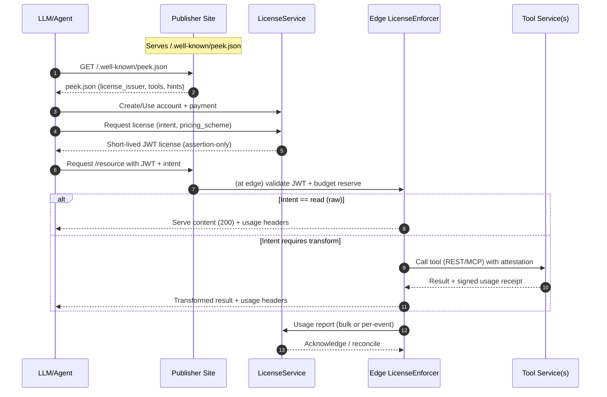

# Peek-Then-Pay (peek.json Specification)

**A collaborative standard for AI-era content access and monetization**

---

## The Holistic Problem

The web is shifting. Publishers need ways to protect and monetize their content in a world where AI
systems and autonomous agents are consuming it at scale. Meanwhile, LLMs and agents need structured,
reliable, and cost-effective ways to discover, license, and transform that same content.

Peek-Then-Pay addresses this need by defining **end-to-end interoperability**: it provides a
flexible foundation where publishers and operators can choose build-vs-buy for individual
components, while still participating in a shared framework. The model encourages **centralization
for licensing and marketplace discovery**, but supports **decentralization for enforcement, content
transformation, and delivery**.

This balance empowers publishers who are already vectorizing their own data and cultivating
microcosms of expertise. With Peek-Then-Pay, they can hoist that expertise into the broader
ecosystem, making it accessible to LLMs through licensed access. For smaller LLMs, this means access
to **cleaner, preprocessed training data**. For larger LLMs, it enables **efficient last-mile search
and personalization**, leveraging publisher-maintained transformations.

Today, the landscape is fragmented:

- **Paywalls** protect access but rarely account for machine-driven use cases.
- **Licensing frameworks** exist, but lack enforceability and real-time integration.
- **Content preparation tools** help make data AI-ready, but don’t tie into licensing.
- **Agentic interfaces** promise new user experiences, but leave publishers out of the revenue loop.

The result: publishers feel exploited, operators struggle with inefficiencies, and the ecosystem
lacks a shared contract for fair collaboration.

Current methodologies either allow access to everything (open crawling, scraping, and ingestion) or
block bots completely (hard paywalls, bot detection, and HTTP 403/401 responses). This binary
approach leaves publishers with little control and bots with few options for responsible access.

Peek-Then-Pay introduces a middle ground: when a crawler or agent requests content, it may be
blocked with a 402 Payment Required response, but is also provided a "peek" at the content and a
[`peek.json`](docs/peek-manifest-fields.md) manifest. This manifest lets crawlers and agents
discover the potential value, licensing terms, and available tools—enabling informed decisions and
fair negotiation.

Peek-Then-Pay addresses this gap by defining an **open standard** for discovery
([`peek.json`](docs/peek-manifest-fields.md)), licensing ([License API](docs/license-api.md)),
enforcement ([Edge Enforcement Guide](docs/recommended-edge-enforcement-guide.md)), and tooling
([Tool Service Guide](docs/tool-service-api.md)). It doesn’t replace existing solutions—it provides
a **cohesive starting point** that connects them into a framework that is fair, extensible, and
mutually beneficial.

For historical context and the evolution from robots.txt to peek.json, see
[From robots.txt to peek.json](docs/robots-to-peek.md).

---

## How Peek-Then-Pay Solves This

1. **Shared Discovery** — A `/.well-known/peek.json` manifest makes publisher terms, pricing, and
   tooling discoverable by agents.
2. **Centralized Licensing & Payments** — A LicenseService provides a single point of integration
   for payments, pricing schemes, and marketplace discovery.
3. **Decentralized Enforcement & Control** — Publishers validate and enforce licenses locally,
   keeping control of content and real-time transformations.
4. **AI-Ready Content** — Publishers expose structured, agent-friendly tools and transforms that
   reduce operator compute and improve results.
5. **Efficiency for Operators** — By offloading search, filtering, and summarization to publishers,
   LLMs save compute cycles while respecting content ownership.

Peek-Then-Pay is designed as a **specification and contract language**: modular, intent-aware, and
extensible. It creates the foundation for an ecosystem where publishers and operators both win.

---

## For Publishers

- **Stay in Control** — Enforce access policies directly at your domain edge (via Workers/CDNs),
  without ceding content to third-party proxies.
- **Simple Monetization** — Define pricing once, and rely on a central LicenseService to manage
  payments and operator accounts.
- **AI-Ready by Default** — Provide optional transforms (summarization, search, ingestion) so your
  content is consistently represented in AI systems.
- **Extend Your Reach** — Smaller publishers gain visibility in a shared marketplace, surfacing in
  AI discovery where they might otherwise be missed.
- **Brand Integrity** — Ensure that when your content is summarized, ingested, or used in AI
  contexts, it reflects your voice and standards.

---

## For LLMs & Agents

- **Unified Access** — Discover participating publishers automatically through `peek.json`
  manifests.
- **One Integration, Many Publishers** — Acquire licenses and handle payments centrally, without
  negotiating with thousands of sites individually.
- **Lower Compute Costs** — Use publisher-provided search, summarization, and transforms to avoid
  expensive, repeated crawling and context building.
- **Structured Contracts** — Operate within a clear legal and technical framework, reducing risk and
  improving compliance.
- **Extensible Tooling** — Access publisher-defined tools (via REST or MCP) for specialized use
  cases (training ingestion, semantic search, etc.).

---

## Key Components

- **Publisher**: Hosts `peek.json`, implements enforcement at the edge, and provides tools for
  AI-ready content.
- **LicenseService**: Centralized payments, account management, and marketplace discovery.
- **LicenseEnforcer**: Publisher-hosted gateway that validates licenses, enforces budgets, and
  reconciles usage.
- **Tools**: Configurable endpoints (REST/MCP) for transforms like summarization, search, ingestion,
  or training.

See [`peek-manifest-fields.md`](docs/peek-manifest-fields.md) for a full reference of the manifest
fields. See [`license-api.md`](docs/license-api.md) for licensing API details. See
[`recommended-edge-enforcement-guide.md`](docs/recommended-edge-enforcement-guide.md) for
enforcement implementation patterns. See [`tool-service-api.md`](docs/tool-service-api.md) for tool
service implementation guidance.

---

## Pricing Models

Peek-Then-Pay supports flexible pricing strategies that balance simplicity for smaller publishers with sophistication for larger use cases:

### 🔹 Flat Fee Per-Crawl 

**What it means:** Every crawl request (page fetch + optional transform) incurs a fixed fee.

**Benefits:**
- Simple mental model for both publishers and LLM operators
- Easy to implement and enforce (each 402 Payment Required maps to one unit)
- Predictable revenue for publishers; predictable expense line for LLMs
- Aligns with traditional "API call" economics

### 🔹 Token-Based Pricing 

**What it means:** Charge based on the number of tokens (or characters/words) delivered after transformation.

**Benefits:**
- Closer alignment with how LLMs themselves are billed (OpenAI, Anthropic, etc. charge per token)
- More "fair" — large pages or heavy data = more cost, small summaries = less cost
- Encourages efficient use of content (operators won't over-ingest unnecessarily)
- Easier for LLM operators to predict ROI because it maps to their training/inference economics

### 🔹 What this means:
- **Small publishers** can stick to flat per-crawl pricing
- **Sophisticated publishers** (already vectorizing data) can plug in token-based pricing for transforms
- **Peek-Then-Pay** stays compatible with both "simple paywall replacement" and "deep AI pipeline licensing"

---

## Architecture Overview (Mermaid)

---

## Included Utilities

This package provides several utility modules to help with conformance and consistency when working
with peek.json manifests and license verification:

### Factory Utilities (`src/utils/factory.ts`)

The factory module provides functions for creating and validating PeekManifest objects:

- **`createPeekManifest(data: unknown): PeekManifest`** - Creates a validated PeekManifest from
  unknown data, throwing PeekValidationError if invalid
- **`createPeekManifestFromFile(filePath: string): Promise<PeekManifest>`** - Loads and validates a
  PeekManifest from a JSON file
- **`PeekValidationError`** - Custom error class for validation failures with detailed error
  information

### Schema Utilities (`src/utils/schema.ts`)

The schema module handles loading and caching of the peek.json JSON Schema:

- **`getSchema(): Promise<JSONSchemaType<PeekManifest>>`** - Asynchronously loads the peek.json
  schema with caching
- **`getSchemaSync(): JSONSchemaType<PeekManifest>`** - Synchronously loads the peek.json schema
  (requires prior async load)
- **`SchemaError`** - Custom error class for schema-related failures

### License Utilities (`src/utils/license-utils.ts`)

The license module provides comprehensive JWT and DPoP (Demonstration of Proof-of-Possession) token
verification:

- **`createLicense(payload: object, options: CreateLicenseOptions): Promise<string>`** - Creates
  ES256-signed JWT licenses
- **`createDpopProof(options: CreateDpopProofOptions): Promise<string>`** - Creates DPoP proof
  tokens for enhanced security
- **`verifyLicense(license: string, options: VerifyLicenseOptions): Promise<object>`** - Verifies
  JWT licenses with comprehensive validation
- **`verifyDpopProof(dpopProof: string, options: VerifyDpopProofOptions): Promise<object>`** -
  Verifies DPoP proof tokens
- **`LicenseError`** - Custom error class for license verification failures

These utilities ensure consistent implementation of peek.json standards and provide robust security
features for license-based content access.

---

## A Starting Point

Peek-Then-Pay is not a finished solution to every challenge—it is a **starting point**. By defining
standards for discovery, licensing, enforcement, and tooling, it creates the groundwork for a fair
and extensible ecosystem.

This project is open source and community-driven. By working together, publishers, operators, and
developers can evolve it into a standard that ensures the web remains both **sustainable for
creators** and **usable for AI systems**.

---

## Contributing

Contributions are welcome:

- Propose changes to the specification
- Improve documentation and examples
- Build reference implementations
- Develop publisher or operator tooling

Together, we can make Peek-Then-Pay the **contract of trust** between publishers and the AI systems
that depend on their content.
