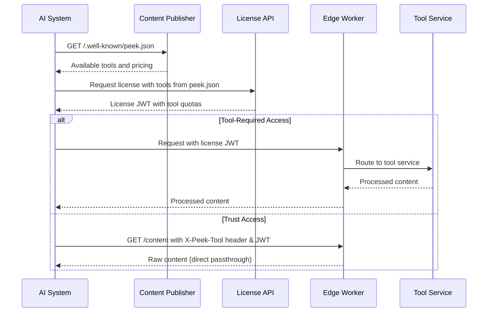

# peek.json: The Next Web Standard for AI Systems

**Defining fair AI-web interaction.** The peek.json standard enables transparent, usage-based licensing between content publishers and AI systems - the evolutionary successor to robots.txt for the AI era.

This repository defines both the **formal peek.json standard specification** and **implementation conventions**. Using tool-naming conventions inspired by the Model Context Protocol (MCP), this standard moves beyond binary "allow/disallow" to nuanced, value-based access control.

**What's Defined Here:**
- 📋 **Standard Specification**: The peek.json manifest format, JSON schema, and API protocols
- 🛠️ **Implementation Conventions**: Edge-centric architecture patterns, enforcement methods, and deployment guidelines
- 📚 **Reference Documentation**: Complete field specifications, license flows, and usage examples

## 🎯 Standard Philosophy

**Cooperative, not Adversarial**: peek.json provides economic incentives for respectful AI behavior while maintaining the proven principles that made robots.txt successful:

- **Free tiers** for basic discovery and previews (like allowing search indexing)
- **Paid tiers** for value-generating activities (training, commercial use)
- **Technical enforcement** via license validation and quota tracking
- **Universal adoption** through standardized discovery and protocols

This creates a sustainable ecosystem where AI development can flourish while fairly compensating content creators.

## 🛠️ Supported Tools & Capabilities

| Tool Name | Description | Typical Use Case |
|-----------|-------------|------------------|
| **peek_resource** | Short previews | Quick content discovery |
| **quote_resource** | Quotable excerpts | Attribution and referencing |
| **get_metadata** | Structured metadata | Content categorization |
| **summarize_resource** | AI-generated summaries | Content understanding |
| **generate_embeddings** | Vector embeddings | Semantic search |
| **prepare_for_rag** | RAG-optimized chunks | Knowledge retrieval |
| **read_resource** | Complete content | Direct consumption |
| **index_resource** | Search optimization | Discovery systems |
| **training** | Model training data | AI model improvement |

## 📄 The peek.json Standard Specification

**Served from `/.well-known/peek.json`** - the standard defines AI access policies through three main sections:

- **`meta`** – Site identity and content categories
- **`enforcement`** – Bot detection and rate limiting  
- **`license`** – License acquisition and tool-based pricing

### Example peek.json
```json
{
  "version": "1.0",
  "meta": {
    "site_name": "TechNews Daily",
    "publisher": "TechNews Corp",
    "domains": ["technews.com"],
    "categories": ["technology", "news"],
    "last_updated": "2025-08-04"
  },
  "license": {
    "license_issuer": "https://api.technews.com/peek/license",
    "terms_url": "https://technews.com/legal/ai-terms",
    "tools": {
      "peek_resource": {
        "allowed": true,
        "license_required": false
      },
      "summarize_resource": {
        "allowed": true,
        "enforcement_method": "both",
        "pricing": {"default_per_page": 0.02},
        "license_required": true
      },
      "train_on_resource": {
        "allowed": false
      }
    }
  }
}
```

## 🚦 License Flow



1. **Discovery**: AI system fetches `/.well-known/peek.json` (or receives 402 response)
2. **License**: AI system requests license for specific tools and usage
3. **Access**: AI system accesses content via edge workers with license validation
4. **Tracking**: License API tracks usage and enforces quotas

## 🔍 Discovery Methods

**Proactive Discovery (Recommended)**:
1. AI system retrieves `/.well-known/peek.json` before accessing content
2. AI system identifies desired tools and checks enforcement methods
3. AI system requests license for specific tools and budgets
4. AI system accesses content based on publisher's enforcement preferences

**Reactive Discovery (Fallback)**:
1. AI system attempts content access without prior policy check
2. Edge worker detects bot and returns 402 Payment Required with peek.json
3. AI system discovers available tools and pricing from response
4. AI system follows proactive discovery process

## 🔄 Content Access Methods

- **Trust**: Direct HTTP request with license headers (publisher trusts honest usage)
- **Tool-required**: Tool service endpoint request (publisher controls output)
- **Both available**: AI system chooses most efficient method for their use case

## 🏗️ Implementation Conventions & Architecture

**Standard-defined patterns for consistent deployment.** The peek.json standard specifies both the manifest format and recommended implementation patterns:

**Architecture Conventions**: Publishers implement tools via **tool services** routed through edge workers - never exposing tool endpoints directly to AI systems.

**Enforcement Conventions**:
- Smart bot detection via User-Agent patterns (`*AI*`, `*GPT*`, `*crawler*`)
- Rate limiting for unlicensed traffic
- 402 Payment Required responses with peek.json discovery
- Graceful failover when licensing unavailable

**Implementation Options**:
- **License API**: In-house OAuth 2.0, SaaS providers, or hybrid solutions
- **Tool Services**: Self-hosted processing, SaaS providers, or CDN integration
- **Edge Workers**: Cloudflare Workers, AWS Lambda@Edge, Fastly VCL

Perfect for modern CDN/edge compute platforms with flexible deployment options.

## 📚 Standard Documentation & References

**Complete specification and implementation guidance:**

- [`docs/robots-to-peek.md`](./docs/robots-to-peek.md) – Evolution from robots.txt to peek.json
- [`docs/field-reference.md`](./docs/field-reference.md) – Complete field specification
- [`docs/license-api.md`](./docs/license-api.md) – License acquisition API specification
- [`docs/edge-architecture.md`](./docs/edge-architecture.md) – Recommended architecture patterns
- [`docs/enforcement-guide.md`](./docs/enforcement-guide.md) – Implementation conventions
- [`examples/peek.json`](./examples/peek.json) – Reference implementation example

**🔗 For production deployment:** See [peek-enforcer](https://github.com/PeekThenPay/peek-enforcer) for ready-to-use edge worker code and deployment guides.

## 🏗️ Standard Components

```
schema/peek.schema.json      # JSON Schema definition (formal specification)
docs/                        # Standard documentation and conventions
examples/peek.json          # Reference implementation example
```

## 🌍 Why peek.json Matters

**The next web standard**: Just as robots.txt became the universal protocol for search engines, peek.json establishes the standard for AI systems.

**For Publishers**: Granular control over AI usage, fair monetization, clear attribution policies, standardized integration, usage transparency

**For AI Systems**: Transparent discovery of access rules, predictable pricing, optimized content delivery, respectful protocols, scalable quota management

**For the Web Ecosystem**: Universal protocol for AI-web interaction, balanced power dynamics, sustainable AI development, web-native implementation
