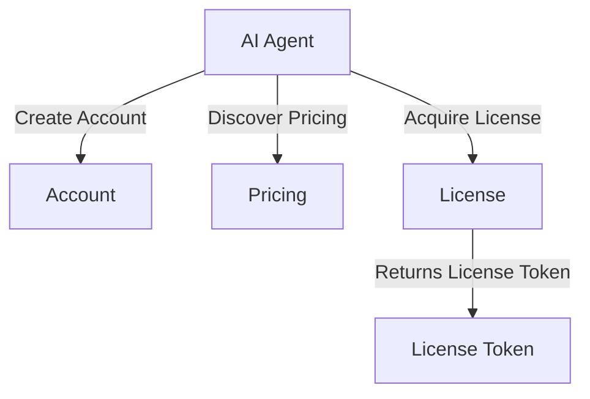
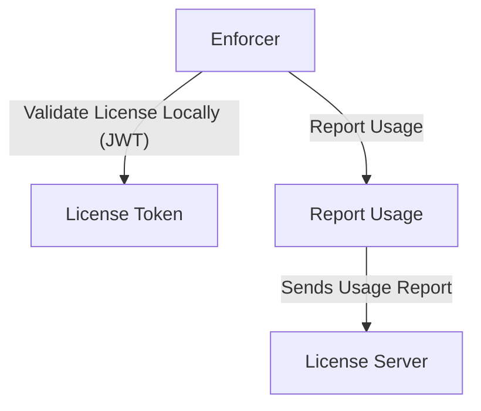
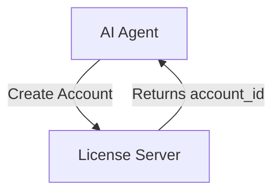
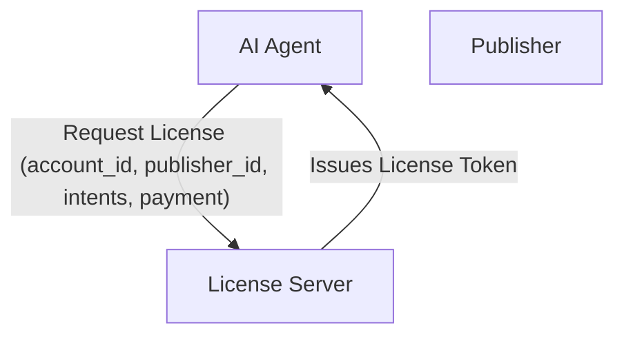
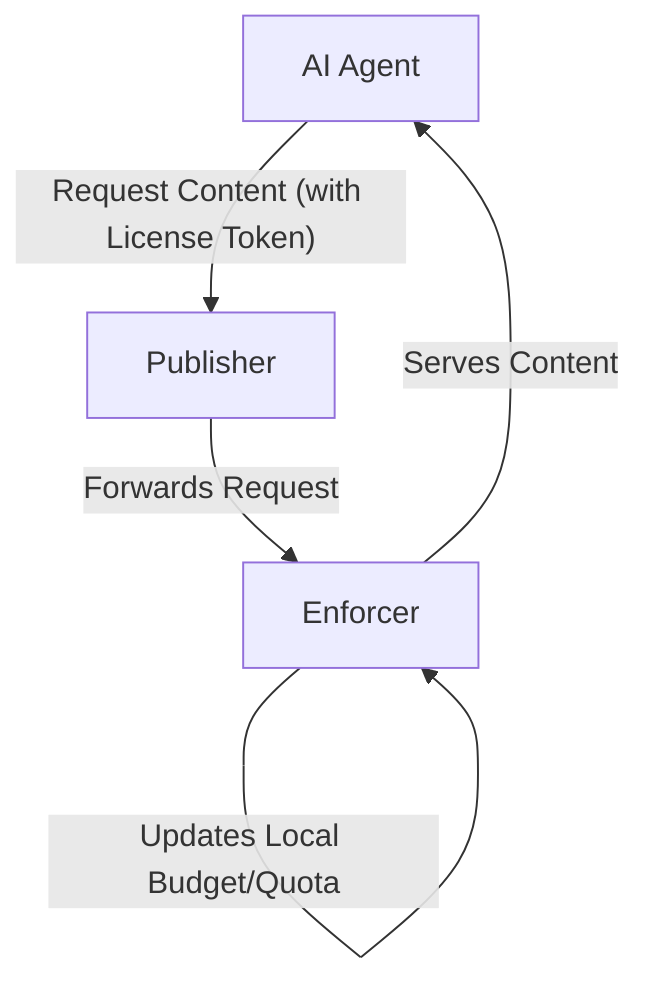
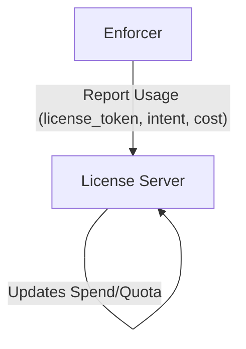

# License API Specification (Peek-Then-Pay)

This document defines the API for securely acquiring, validating, and reporting licenses for AI
access to publisher content. It is designed for use by enforcers (e.g., CDN/edge workers) and AI
agents, and supports flexible pricing, quota, and enforcement models.

**Roles:**

- Enforcers use the API to validate licenses and monitor/report usage for content access.
- AI agents use the API to discover pricing and capabilities, create accounts, associate payment
  methods, acquire licenses, and access content in accordance with license terms. All tool/pricing
  configuration is managed in the license server and returned via the API.

---

## Payment Proxy Model

The license server does **not** handle, store, or process credit card numbers or sensitive payment
data. Instead, it acts as a secure proxy, facilitating direct payment interactions between AI agent
and publisher accounts using third-party payment providers (e.g., Stripe, PayPal, etc.).

- AI agents register a payment method by providing a tokenized reference (e.g., a payment provider
  token) to the license server.
- When a license is acquired, the license server coordinates the payment transaction between the AI
  agent and publisher accounts using these tokens, but never directly accesses or stores raw payment
  details.
- All payment processing is handled by the external payment provider, ensuring PCI compliance and
  security.
- The license server only tracks payment status, transaction references, and account associations
  for licensing purposes.

---

## AI Agent Endpoints & Usage

This section covers endpoints and flows used by AI agents to discover pricing, create accounts,
acquire licenses, and manage payment methods.



## Endpoints

### 1. Account Management

**POST /account**

- AI agent creates an account with the license server to receive a unique `account_id`.
- Optionally associates a `default_payment_method` (so the agent does not need to provide a payment
  method on every license request).

**Example Request:**

```json
{
  "name": "AcmeAI Agent",
  "contact_email": "ops@acmeai.com",
  "default_payment_method": {
    "provider": "stripe",
    "token": "tok_visa_123456",
    "expires_at": "2025-09-01T00:00:00Z"
  }
}
```

**Example Response:**

```json
{
  "account_id": "acc-7890abcd-1234-5678-efgh-9876543210ab",
  "status": "active",
  "default_payment_method": {
    "provider": "stripe",
    "expires_at": "2025-09-01T00:00:00Z",
    "valid": true
  }
}
```

### 2. Discover Pricing & Tool Capabilities

**GET /publisher/{publisher_id}/pricing?account_id={account_id}**

- Used by AI agents to discover all available pricing options for a publisher.
- The `account_id` must be provided (as a query parameter or header) so the license API can
  determine the appropriate pricing scheme for that AI agent account.
- May return different pricing for different accounts (e.g., discounts for smaller LLMs or preferred
  partners).
- Includes all supported intents, quotas, path-based multipliers, and a `pricing_scheme_id` (UUID)
  for cache validation.

**Example Request:**

```
GET /publisher/b7e2a8e2-4c3a-4e2a-9c1a-2f7e8b9c1d2e/pricing?account_id=acc-7890abcd-1234-5678-efgh-9876543210ab
```

**Example Response:**

```json
{
  "pricing_scheme_id": "b7e2c8e2-1a2b-4c3d-9e4f-123456789abc",
  "publisher_id": "b7e2a8e2-4c3a-4e2a-9c1a-2f7e8b9c1d2e",
  "intents": {
    "summarize_resource": {
      "intent": "summarize_resource",
      "price": 0.02,
      "license_required": true,
      "enforcement_method": "tool_required",
      "path_multipliers": {
        "/premium/*": 2.0,
        "/api/v1/*": 0.5
      }
    },
    "read_resource": {
      "intent": "read_resource",
      "price": 0.05,
      "license_required": true,
      "enforcement_method": "trust"
    }
  }
}
```

### 3. Acquire License

**POST /publisher/{publisher_id}/license**

- AI agent requests a license for specific intents and enforcement method.
- May provide a `payment_method` for this license request. If not provided, the account's
  `default_payment_method` will be used.
- If neither is provided or the payment method is expired/invalid, an error is returned.

**Example Request (with payment_method):**

```json
{
  "ai_agent_account_id": "acc-7890abcd-1234-5678-efgh-9876543210ab",
  "publisher_id": "b7e2a8e2-4c3a-4e2a-9c1a-2f7e8b9c1d2e",
  "pricing_scheme_id": "b7e2c8e2-1a2b-4c3d-9e4f-123456789abc",
  "intents": ["summarize_resource", "read_resource"],
  "budget": 100.0,
  "payment_method": {
    "provider": "stripe",
    "token": "tok_visa_789012",
    "expires_at": "2025-10-01T00:00:00Z"
  }
}
```

**Example Request (no payment_method, uses default):**

```json
{
  "ai_agent_account_id": "acc-7890abcd-1234-5678-efgh-9876543210ab",
  "publisher_id": "b7e2a8e2-4c3a-4e2a-9c1a-2f7e8b9c1d2e",
  "pricing_scheme_id": "b7e2c8e2-1a2b-4c3d-9e4f-123456789abc",
  "intents": ["summarize_resource", "read_resource"],
  "budget": 100.0
}
```

**Example Error Response (no valid payment method):**

```json
{
  "error": "payment_method_missing_or_expired",
  "message": "No valid payment method found. Please provide a valid payment method or set a default on your account."
}
```

---

## Enforcer Endpoints & Usage

This section covers endpoints and flows used by enforcers (e.g., CDN/edge workers) to validate
licenses locally (using JWTs) and report usage.



## Endpoints

### 1. License Validation (Local JWT Validation)

Enforcers validate license tokens locally using the signed JWT provided by the license server. All
necessary context for enforcement (tools, prices/credits, path cost multipliers, quotas,
restrictions, and `pricing_scheme_id`) is embedded in the JWT payload. No API call to the license
server is required for each request.

**Validation Flow:**

- Enforcer receives a license token (JWT) from the AI agent.
- Enforcer verifies the JWT signature and extracts enforcement context from the payload.
- Enforcer enforces quotas, pricing, and restrictions locally.

**Example JWT Payload:**

```json
{
  "iss": "license-server.example.com",
  "aud": "publisher.example.com",
  "sub": "acc-7890abcd-1234-5678-efgh-9876543210ab",
  "exp": "2025-08-09T12:00:00Z",
  "publisher_id": "b7e2a8e2-4c3a-4e2a-9c1a-2f7e8b9c1d2e",
  "tools": [
    {
      "intent": "summarize_resource",
      "price": 0.02,
      "license_required": true,
      "enforcement_method": "tool_required",
      "path_multipliers": { "/premium/*": 2.0 }
    }
  ],
  "budget": 100.0,
  "license_id": "lease-abc123",
  "pricing_scheme_id": "b7e2c8e2-1a2b-4c3d-9e4f-123456789abc"
}
```

### 2. Usage Reporting (Record)

**POST /publisher/{publisher_id}/license/report**

- Enforcer reports usage after content is served to the AI agent.
- Supports robust reporting and credit management.

**Example Request (bulk reporting):**

```json
{
  "events": [
    {
      "license_token": "lease-abc123",
      "intent": "summarize_resource",
      "tool_used": true,
      "success": true,
      "budget_before": 100,
      "cost_deducted": 2,
      "budget_after": 98,
      "path": "/premium/article-1"
    },
    {
      "license_token": "lease-abc123",
      "intent": "read_resource",
      "tool_used": false,
      "success": false,
      "failure_reason": "quota_exceeded",
      "budget_before": 98,
      "cost_deducted": 0,
      "budget_after": 98,
      "path": "/api/v1/data"
    }
  ]
}
```

**Example Response:**

```json
{
  "success": true,
  "processed": 2,
  "errors": []
}
```

---

## Lease & Credit Management

- Credits are reserved for the lease duration and only consumed on confirmed usage.
- Unused credits are returned to the publisher’s budget at lease expiry or revocation.
- The `/report` endpoint must indicate if:
  1. There was an error (no credits used)
  2. Usage was successful (credits consumed)
  3. The request was invalid (no credits used, event logged)

---

## Pricing Scheme IDs

- All pricing responses include a `pricing_scheme_id` field (UUID).
- Enforcers and AI agents use the `pricing_scheme_id` to ensure they are using the correct pricing
  logic for spend calculations and compliance.
- A license may reference a custom pricing scheme, which overrides the general pricing for that
  publisher.

---

## Payment Token Expiration & Validity

- When a AI agent registers a payment token, the license server should store and track the token's
  expiration date (if provided by the payment provider).
- The API should expose the payment token's status and expiration in account and license acquisition
  responses.
- If a token is expired or invalid, the license server should proactively notify the AI agent (via
  API response or webhook) before a license acquisition fails.
- License acquisition requests must fail with a clear error if the payment token is expired or
  invalid, including instructions to update the payment method.

**Example Error Response:**

```json
{
  "error": "payment_token_expired",
  "message": "Your payment method has expired. Please update your payment information to acquire new licenses.",
  "update_payment_url": "https://license.example.com/account/update-payment"
}
```

**Example Account Status Response:**

```json
{
  "account_id": "acc-7890abcd-1234-5678-efgh-9876543210ab",
  "status": "active",
  "payment_method": {
    "provider": "stripe",
    "token": "tok_visa_123456",
    "expires_at": "2025-09-01T00:00:00Z",
    "valid": true
  }
}
```

---

## Security & DDoS Protection

- All API calls (except account creation) require authentication with a valid account (e.g., OAuth2,
  JWT).
- Pricing discovery, license acquisition, validation, and reporting endpoints must verify the
  caller’s identity and permissions.
- Account creation should include anti-abuse measures (e.g., CAPTCHA, email verification, rate
  limiting).
- No public pricing: all pricing queries require an authenticated account.
- Apply rate limiting to all endpoints, especially `/account`, `/pricing`, `/license`, and
  `/authorize`.
- Use IP-based, account-based, and publisher-based limits to prevent DDoS and brute-force attacks.
- Integrate with DDoS protection services (e.g., Cloudflare, AWS Shield) as needed.
- Validate all incoming data to prevent injection and abuse.
- Log all API activity and monitor for unusual patterns; set up alerts for excessive requests or
  failed auth.
- Return clear, secure error messages and throttle repeated failed requests.

---

## Best Practices

- Use short-lived, signed tokens (JWT/lease) for efficient, cacheable authorization.
- Enforcers should perform local spend calculations using cached pricing/config.
- Batch usage reporting is supported for performance.
- All events should be logged for audit and compliance.

---

## AI Agent Account Acquisition Flow



## License Acquisition Flow



## License Usage & Enforcement Flow



## Usage Reporting Flow



_This document is the reference for the license API only. For peek.json manifest fields, see
`peek-manifest-fields.md`._
