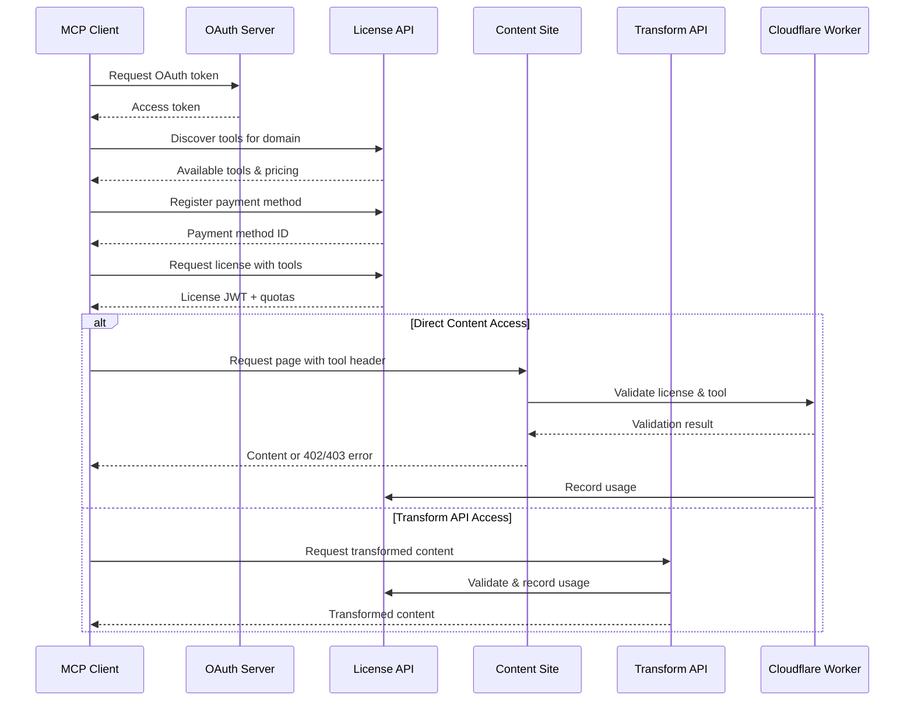
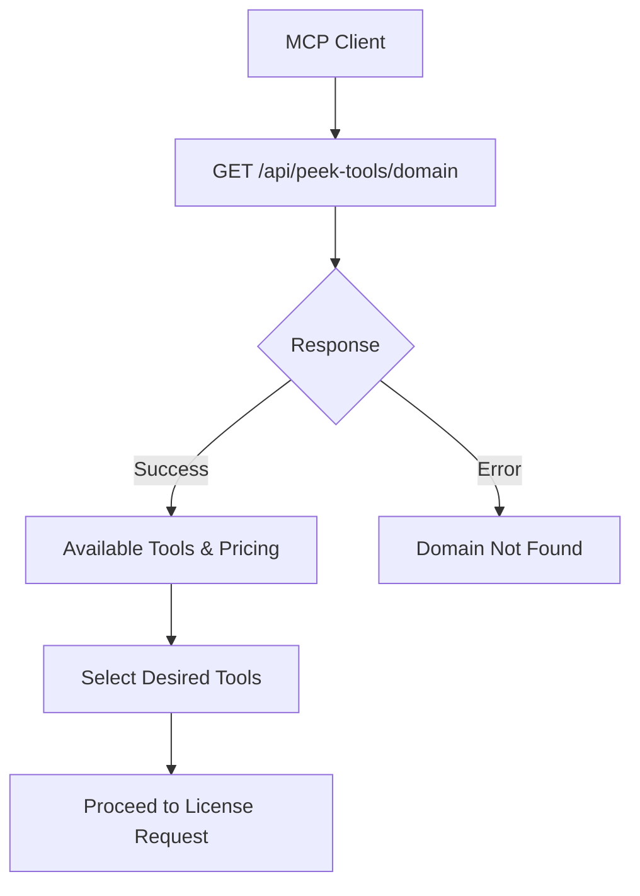
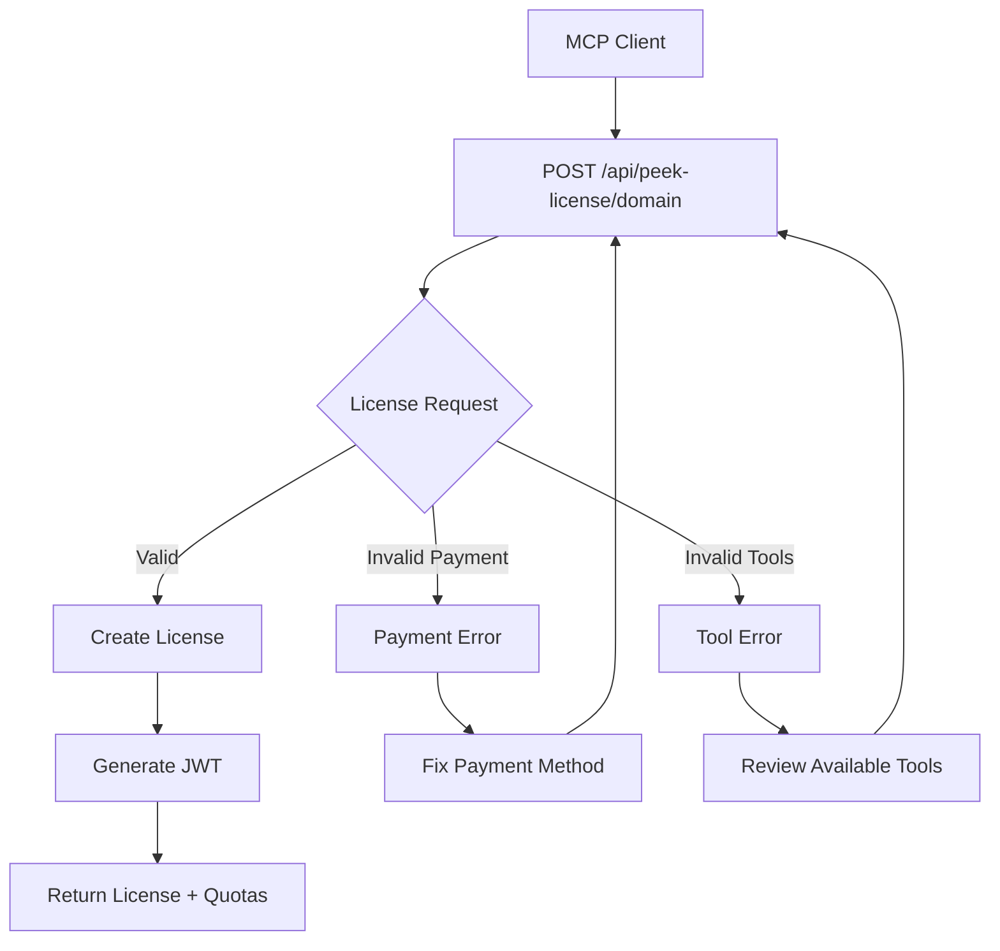
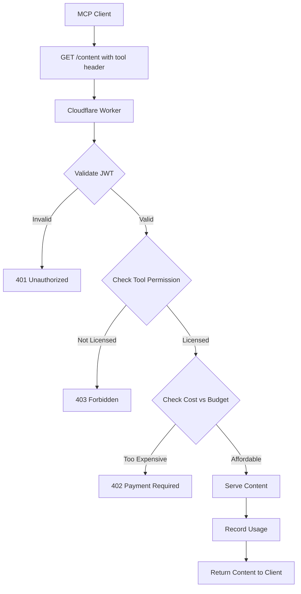
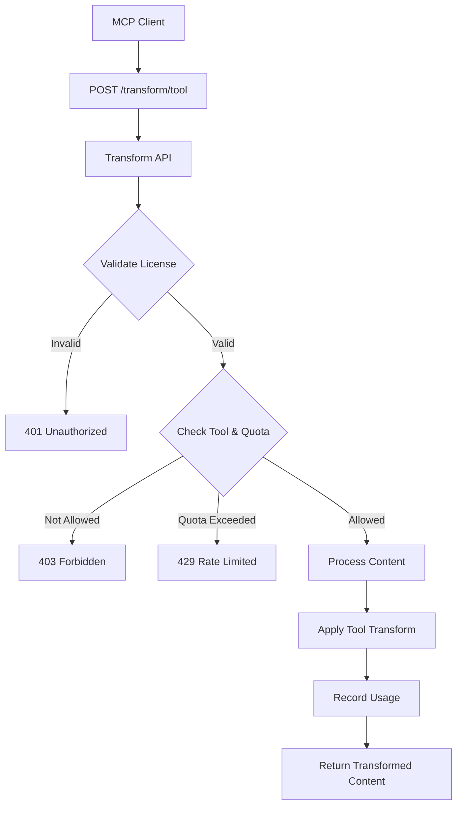
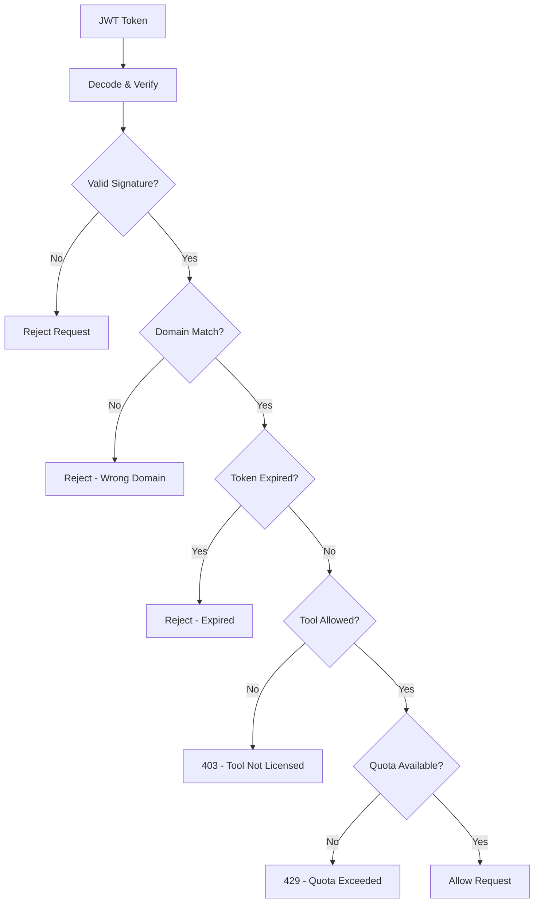

# License Issuer API Specification (MCP Tool-Based OAuth 2.0 Model)

This document defines the API used by MCP clients to securely acquire, use, and manage licenses for accessing protected content using the Peek-Then-Pay standard with tool-based licensing. This version assumes centralized identity and billing via OAuth 2.0.

## 🌊 Overall Flow



---

## 🔍 Step 0b: Discover Available Tools

Before requesting a license, MCP clients should discover available tools for a domain.



### GET /api/peek-tools/{domain}

**Headers:**
```
Authorization: Bearer <access_token>
```

**Response:**
```json
{
  "domain": "example.com",
  "available_tools": {
    "peek_resource": {
      "allowed": true,
      "license_required": false,
      "pricing": null
    },
    "summarize_resource": {
      "allowed": true,
      "license_required": true,
      "pricing": {
        "default_per_page": 0.02,
        "max_per_page": 0.10
      }
    },
    "rag_query": {
      "allowed": true,
      "license_required": true,
      "pricing": {
        "default_per_page": 0.03,
        "max_per_page": 0.15,
        "free_quota": 10
      }
    },
    "train_on_resource": {
      "allowed": false
    }
  },
  "global_pricing": {
    "currency": "USD"
  }
}
```

---

## 🔐 Step 0: OAuth 2.0 Authentication

All license-related endpoints require a valid OAuth 2.0 access token.

### POST /oauth/token

**Request (client credentials grant):**

```x-www-form-urlencoded
grant_type=client_credentials
&client_id=my-llm-agent
&client_secret=supersecret123
```

**Response:**

```json
{
  "access_token": "eyJhbGciOiJIUzI1NiIsInR5cCI6...",
  "token_type": "Bearer",
  "expires_in": 3600
}
```

Use the `access_token` as a Bearer token in all subsequent API requests.

---

## 💳 Step 1: Register Payment Method

### POST /api/payment-method

Registers a reusable payment method using a token from a secure billing provider (e.g., Stripe, Paddle).

**Headers:**
```
Authorization: Bearer <access_token>
```

**Body:**
```json
{
  "payment_method_token": "tok_stripe_abc123"
}
```

**Response:**
```json
{
  "payment_method_id": "pm_abc123"
}
```

---

## 🧾 Step 2: Request License for a Domain

Acquires a license to access content on a specific domain with specified tools.



### POST /api/peek-license/{domain}

**Headers:**
```
Authorization: Bearer <access_token>
```

**Body:**
```json
{
  "monthly_limit": 50.00,
  "payment_method_id": "pm_abc123",
  "tools": ["peek_resource", "summarize_resource", "rag_query", "generate_embeddings"],
  "tool_limits": {
    "summarize_resource": 100,
    "rag_query": 200,
    "generate_embeddings": 500
  }
}
```

**Response:**
```json
{
  "license_id": "lic_001122",
  "jwt": "eyJhbGciOiJIUzI1NiIsInR5cCI6...",
  "spend_remaining": 50.00,
  "licensed_tools": ["peek_resource", "summarize_resource", "rag_query", "generate_embeddings"],
  "tool_quotas": {
    "peek_resource": "unlimited",
    "summarize_resource": 100,
    "rag_query": 200,
    "generate_embeddings": 500
  }
}
```

---

## 📄 Step 3: Request Content Page (via Worker)

MCP clients send a licensed content request to `example.com` with a specified tool.



**GET https://example.com/articles/ai-ethics**

**Headers:**
```
X-Peek-License: lic_001122
Authorization: Bearer <jwt>
X-Peek-Tool: summarize_resource
X-Max-Page-Spend: 0.03
X-Output-Format: json
```

If the tool is not licensed:

```http
HTTP/1.1 403 Forbidden
X-Error: tool_not_licensed
X-Available-Tools: peek_resource,rag_query,generate_embeddings
```

If the page is too expensive for the tool:

```http
HTTP/1.1 402 Payment Required
X-Required-Page-Spend: 0.07
X-Tool: summarize_resource
```

---

## 🔄 Step 3b: Use Transform API (Alternative)

Instead of direct page access, MCP clients can use the transform API for structured content.



**POST https://api.example.com/peek/transform/summarize_resource**

**Headers:**
```
Authorization: Bearer <jwt>
X-Peek-License: lic_001122
Content-Type: application/json
```

**Body:**
```json
{
  "url": "https://example.com/articles/ai-ethics",
  "output_format": "json"
}
```

**Response:**
```json
{
  "summary": "## Key Points\n\n- AI ethics frameworks are evolving...",
  "format": "markdown",
  "cost": 0.02,
  "tool": "summarize_resource"
}
```

---

## 📉 Step 4: Record Usage

### POST /api/peek-license/{domain}/{license_id}/record

Cloudflare Worker reports page access for metering and deduction with tool tracking.

**Headers:**
```
Authorization: Bearer <jwt>
```

**Body:**
```json
{
  "url": "/articles/ai-ethics",
  "tool": "summarize_resource",
  "page_cost": 0.03,
  "output_format": "json",
  "success": true
}
```

**Response:**
```json
{
  "spend_remaining": 49.97,
  "pages_fetched": 1,
  "total_spent": 0.03,
  "tool_usage": {
    "summarize_resource": {
      "pages_used": 1,
      "quota_remaining": 99,
      "total_cost": 0.03
    }
  },
  "notifications_sent": []
}
```

---

## 🔐 JWT License Structure (suggested)



```json
{
  "sub": "lic_001122",
  "scope": "example.com",
  "monthly_limit": 50.00,
  "tools": ["peek_resource", "summarize_resource", "rag_query", "generate_embeddings"],
  "tool_quotas": {
    "peek_resource": -1,
    "summarize_resource": 100,
    "rag_query": 200,
    "generate_embeddings": 500
  },
  "exp": 1722120000
}
```

The Cloudflare Worker should verify the JWT signature and ensure:
- `scope` matches the current domain
- `exp` has not passed
- The requested `tool` is included in the `tools` array
- The tool hasn't exceeded its quota (if applicable)
