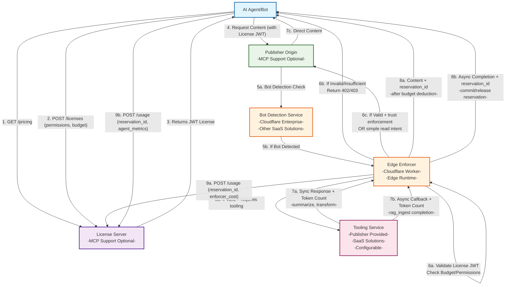

# License API Specification (Peek-Then-Pay)

This document defines the API for securely acquiring, validating, and reporting licenses for AI
access to publisher content. It is designed for use by enforcers (e.g., CDN/edge workers) and AI
agents, and supports usage-based pricing, intent-specific permissions, and flexible enforcement
models.

For comprehensive information about usage contexts and pricing, see the
[Usage Context Guide](usage-context-guide.md) and
[Normative Intent Definitions](normative-intent-definitions.md).

**Roles:**

- AI agents/operators use the API to discover pricing and capabilities, create accounts, associate
  payment methods, acquire licenses, and access content in accordance with license terms. All
  tool/pricing configuration is managed in the license server and returned via the API.
- Enforcers use the API to report usage for content access.

---

## AI Agent/Operator Endpoints & Usage

This section covers endpoints and flows used by AI agents to discover pricing, create accounts,
acquire licenses, and manage payment methods.



## Endpoints

### 1. Discover Pricing & Tool Capabilities

**GET /pricing?publisher_id={publisher_id}&account_id={account_id}**

- Used by AI agents to discover all available pricing options for a publisher.
- The `account_id` may be provided to determine any custom pricing scheme for that AI agent account.
- May return different pricing for different accounts (e.g., discounts for smaller LLMs or preferred
  partners).
- Response includes all supported intents, quotas, path-based multipliers, and a `pricing_scheme_id`
  (ULID) for cache validation.

**Example Request:**

```
GET /pricing?publisher_id=01HQ2Z3Y4K5M6N7P8Q9R0S1T1X&account_id=01HQ2Z3Y4K5M6N7P8Q9R0S1T1Y
```

**Example Response:**

```json
{
  "id": "01HQ2Z3Y4K5M6N7P8Q9R0S1T2Y",
  "publisher_id": "01HQ2Z3Y4K5M6N7P8Q9R0S1T1X",
  "operator_id": "01HQ2Z3Y4K5M6N7P8Q9R0S1T1Y",
  "pricing_digest": "sha256:custom-discount",
  "currency": "USD",
  "cache_ttl_seconds": 3600,
  "intents": {
    "read": {
      "intent": "read",
      "pricing_mode": "per_request",
      "enforcement_method": "tool_required",
      "usage": {
        "immediate": { "price_cents": 1 },
        "session": { "price_cents": 2, "max_ttl_seconds": 3600 },
        "train": { "price_cents": 500, "requires_contract": true }
      }
    },
    "summarize": {
      "intent": "summarize",
      "pricing_mode": "per_request",
      "enforcement_method": "tool_required",
      "usage": {
        "immediate": { "price_cents": 2 },
        "session": { "price_cents": 4, "max_ttl_seconds": 1800 }
      },
      "model": {
        "id": "sum:gpt-4o-mini@v1",
        "provider": "openai",
        "name": "gpt-4o-mini",
        "version": "v1",
        "digest": "sha256:gpt4omini-digest-v1"
      }
    }
  },
  "quotas": {
    "burst_rps": 50,
    "max_license_duration_seconds": 3600
  }
}
```

### 2. Acquire License

**POST /licenses**

- AI agent requests a license for specific intents and enforcement method.

**Example Request (with payload):**

POST /licenses?publisher_id=01HQ2Z3Y4K5M6N7P8Q9R0S1T1X

```json
{
  "publisher_id": "01HQ2Z3Y4K5M6N7P8Q9R0S1T1X",
  "pricing_scheme_id": "01HQ2Z3Y4K5M6N7P8Q9R0S1T2Y",
  "permissions": ["read:immediate", "read:session"],
  "budget_cents": 1000
}
```

**Example Response:**

```json
{
  "license_id": "01HKQM8Z1A2B3C4D5E6F7G8H9J",
  "license_jwt": "eyJhbGciOiJSUzI1NiIsInR5cCI6IkpXVCIsImtpZCI6Im9wZXJhdG9yLWtleSJ9.eyJpc3MiOiJmZXRjaHJpZ2h0LWFwaSIsInN1YiI6IjAxSEtRTTdZOFg5WjJCM0M0RDVFNkY3RzhIIiwiYXVkIjoiMDFIS1FNN1k4WDlaYjNDNEQ1RTZGNyIsImV4cCI6MTY5NDQ1MzQwMCwiaWF0IjoxNjk0NDUyNTAwLCJsaWNlbnNlX2lkIjoiMDFIS1FNOFoxQTJCM0M0RDVFNkY3RzhIOUoiLCJwdWJsaXNoZXJfaWQiOiIwMUhLUU03WThYOVoyQjNDNEQ1RTZGN0c4SCIsInByaWNpbmdfc2NoZW1lX2lkIjoiZGVmYXVsdC1yZWFkLXN1bW1hcml6ZSIsInByaWNpbmdfc2NoZW1lX3R5cGUiOiJkZWZhdWx0IiwibGljZW5zZWVfaWQiOiIwMUhLUU03WThYOVoyQjNDNEQ1RTZGN0c4SCIsImludGVudHMiOlsicmVhZCIsInN1bW1hcml6ZSJdLCJidWRnZXRfY2VudHMiOjEwMDAsImlzc3VlZF9hdCI6IjIwMjQtMDktMTdUMTQ6MDg6MjBaIiwiZXhwaXJlc19hdCI6IjIwMjQtMDktMTdUMTQ6MjM6MjBaIiwibWV0YWRhdGEiOnsiY2xpZW50X3ZlcnNpb24iOiIxLjAuMCIsInNlc3Npb25faWQiOiJzZXNzX2FiYzEyMyJ9fQ.M8L2P9x1vC3nB7f8QhGjKlMnOpQrStUvWxYzAbCdEfGhIjKlMnOpQrStUvWxYzAbCdEfGhIjKlMnOpQrStUvWxYzAbCdEfGhIjKlMnOpQrStUvWxYzAbCdEfGhIjKlMnOpQrStUvWxYzAbCdEfGhIjKlMnOpQrStUvWxYzAbCdEfGhIjKlMnOpQrStUvWxYzAbCdEfGhIjKlMnOpQrStUvWxYzAbCdEfGhIjKlMnOpQrStUvWxYzAbCdEfGh",
  "expires_at": "2024-09-17T14:23:20Z"
}
```

**Example format of decoded JWT Payload:**

```json
{
  "iss": "fetchright-api",
  "sub": "01HKQM7Y8X9Z2B3C4D5E6F7G8H",
  "aud": "01HKQM7Y8X9Zb3C4D5E6F7",
  "exp": 1694453400,
  "iat": 1694452500,
  "license_id": "01HKQM8Z1A2B3C4D5E6F7G8H9J",
  "publisher_id": "01HQ2Z3Y4K5M6N7P8Q9R0S1T1X",
  "pricing_scheme_id": "01HQ2Z3Y4K5M6N7P8Q9R0S1T2Y",
  "pricing_scheme_type": "default",
  "licensee_id": "01HKQM7Y8X9Z2B3C4D5E6F7G8H",
  "permissions": ["read:immediate", "summarize:session"],
  "budget_cents": 1000,
  "issued_at": "2024-09-17T14:08:20Z",
  "expires_at": "2024-09-17T14:23:20Z",
  "metadata": {
    "client_version": "1.0.0"
  }
}
```

---

## Enforcer Endpoints & Usage

### 1. Usage Reporting (Record)

**POST /usage/publisher/bulk**

- Enforcer reports usage after content is served to the AI agent.
- Supports robust reporting and credit management.

**Example Request (bulk reporting):**

```json
{
  "license_id": "01HKQM8Z1A2B3C4D5E6F7G8H9J",
  "usage_results": [
    {
      "reservation_id": "01HKQM9A1B2C3D4E5F6G7H8I9J",
      "license_id": "01HKQM8Z1A2B3C4D5E6F7G8H9J",
      "permission": "read:immediate",
      "amount_cents": 150,
      "path": "/api/v1/documents/123/content",
      "request_time": "2024-09-17T14:10:00Z",
      "resolve_time": "2024-09-17T14:10:02Z",
      "success": true,
      "metadata": {
        "document_size": "2048",
        "content_type": "application/pdf"
      }
    },
    {
      "reservation_id": "01HKQM9B2C3D4E5F6G7H8I9J0K",
      "license_id": "01HKQM8Z1A2B3C4D5E6F7G8H9J",
      "permission": "summarize:session",
      "amount_cents": 300,
      "path": "/api/v1/documents/123/summary",
      "request_time": "2024-09-17T14:10:05Z",
      "resolve_time": "2024-09-17T14:10:12Z",
      "success": true,
      "metadata": {
        "summary_length": "250",
        "processing_model": "gpt-4",
        "agent": "FetchRight-Summarizer/1.0.0"
      }
    }
  ],
  "metadata": {
    "publisher_version": "2.1.0"
  }
}
```

**Example Response:**

```json
{
  "status": "success",
  "data": {
    "usage_report_id": "01HKQM9D4E5F6G7H8I9J0K1L2M",
    "total_results": 2,
    "successful_results": 2,
    "failed_results": 0,
    "total_amount_cents": 450,
    "failures": undefined
  }
}
```

---

## Lease & Credit Management

- Budget should be reserved for the license duration and only consumed on confirmed usage.
- Unused budget should be returned to the operator’s budget at license expiry or exhaustion.

---

## Pricing Schema Validation

### pricing.schema.json

The pricing configuration returned by the `/pricing` endpoint follows a standardized JSON schema
defined in `schema/pricing.schema.json`. This schema ensures consistency and validity of pricing
data across all implementations.

**Key Schema Features:**

- **ULID Validation**: Pricing scheme IDs and publisher IDs must be valid ULIDs (26 character Base32
  strings)
- **SHA256 Digest Validation**: Pricing digests must follow the format `sha256:[64-char-hex]`
  (case-insensitive)
- **Intent Enforcement**: Only valid intent types are allowed (`peek`, `read`, `summarize`, `quote`,
  `embed`, `qa`, `translate`, `analyze`)
- **Usage-Based Pricing**: Each intent supports multiple usage contexts (`immediate`, `session`,
  `index`, `train`, `distill`, `audit`)
- **Permission System**: Licenses use compound permission strings (e.g., `"read:train"`,
  `"summarize:immediate"`)
- **Enforcement Methods**: Limited to `trust` or `tool_required` values
- **Pricing Modes**: Either `per_request` or `per_1000_tokens`
- **Currency Support**: Extensible currency support (currently focused on USD)

**Schema Structure:**

```json
{
  "pricing_scheme_id": "01HQ2Z3Y4K5M6N7P8Q9R0S1T2Y",
  "pricing_digest": "sha256:a1b2c3d4e5f6789012345678901234567890123456789012345678901234abcd",
  "publisher_id": "01HQ2Z3Y4K5M6N7P8Q9R0S1T1X",
  "currency": "USD",
  "cache_ttl_seconds": 3600,
  "intents": {
    "read": {
      "intent": "read",
      "pricing_mode": "per_request",
      "enforcement_method": "trust",
      "usage": {
        "immediate": { "price_cents": 1 },
        "session": { "price_cents": 2, "max_ttl_seconds": 3600 },
        "train": { "price_cents": 1000, "requires_contract": true }
      }
    }
  },
  "quotas": {
    "burst_rps": 100,
    "max_license_duration_seconds": 3600
  }
}
```

For detailed validation utilities, error handling, and implementation guidelines, see the
[Validation Utilities Technical Reference](validation-utilities.md).

---

## Pricing Scheme IDs

- All pricing responses include a `pricing_scheme_id` field (ULID).
- Enforcers and AI agents/operators use the `pricing_scheme_id` to ensure they are using the correct
  pricing logic for spend calculations and compliance.
- A license may reference a custom pricing scheme, which overrides the general pricing for that
  publisher.

---

## Security

- All API calls (except pricing) should require authentication with a valid account.
- License acquisition and reporting endpoints must verify the caller’s identity and permissions.

## License Acquisition Flow

The license acquisition process corresponds to steps 1-3 in the [main workflow diagram](#overview)
above:

- **Step 1**: Agent discovers available permissions and pricing via `GET /pricing`
- **Step 2**: Agent requests license with specific permissions and budget via `POST /licenses`
- **Step 3**: Server returns JWT license token for authorized usage

## License Usage & Enforcement Flow

Content access and enforcement involves multiple edge services and decision points (steps 4-7 in the
[main workflow diagram](#overview)):

### Edge Detection & Enforcement (Steps 4-6)

- **Step 4**: Agent requests content from publisher origin, including JWT license
- **Step 5a-5b**: Bot detection service (e.g., Cloudflare Enterprise) identifies automated traffic
  and routes to edge enforcer
- **Step 6a**: Edge enforcer (Cloudflare Worker, etc.) validates JWT license and checks
  budget/permissions
- **Step 6b**: Invalid/insufficient licenses receive immediate 402/403 response
- **Step 6c**: Valid licenses with `enforcement_method=trust` or simple `read` intents fetch content
  directly from publisher
- **Step 6d**: Valid licenses requiring transformation route to configurable tooling services

### Tooling & Budget Management (Steps 7-8)

- **Step 7a**: **Synchronous tooling** - `summarize`, `transform` return content + token counts to
  enforcer
- **Step 7b**: **Asynchronous tooling** - `rag_ingest` callbacks return completion status + token
  counts to enforcer
- **Step 7c**: **Direct content** - trusted read operations served directly from publisher,
  bypassing tooling
- **Step 8a**: **Enforcer response** - calculates final cost, deducts from local budget, serves
  content + `reservation_id` to agent
- **Step 8b**: **Async completion** - enforcer commits or releases budget reservations, notifies
  agent with `reservation_id`

### Budget Reservation & Coordination Model

- **Synchronous Operations**: Enforcer reserves estimated budget, adjusts after receiving actual
  token counts, responds with `reservation_id`
- **Asynchronous Operations**: Enforcer reserves estimated budget, provides initial
  `reservation_id`, updates on completion
- **Reservation Tracking**: All agent responses include `reservation_id` for bilateral usage
  reporting coordination
- **Tooling Services**: Report token usage (input/output tokens) but do not handle budgets,
  licensing, or reservation IDs

### Composable Architecture Notes

- **Bot Detection**: Best-of-breed SaaS solutions (Cloudflare Enterprise, others) handle detection
- **Tooling Services**: Configurable - publisher-provided or third-party SaaS solutions
- **MCP Support**: Both publishers and license servers may optionally support Model Context Protocol
  for enhanced agent integration

## Usage Reporting Flow

Usage reporting follows a **bilateral model** with coordination via reservation IDs (step 9 in the
[main workflow diagram](#overview)):

- **Dual Reporting**: Both enforcer and agent report usage to the license server via `POST /usage`
- **Reservation Coordination**: All enforcer responses include `reservation_id` for usage
  correlation
- **Enforcer Reporting**: Reports actual costs, budget deductions, and enforcement decisions
- **Agent Reporting**: Reports client-side metrics, performance data, and usage confirmation

### Reservation-Based Coordination

- **Step 9a**: **Enforcer reports** `reservation_id` with actual costs, token usage, processing time
- **Step 9b**: **Agent reports** same `reservation_id` with client metrics, success/failure status,
  latency

### Budget Reservation Lifecycle

1. **Initial Reservation**: Enforcer reserves estimated budget when routing to sync/async tooling
2. **Response with ID**: All responses to agent include `reservation_id` for usage tracking
3. **Bilateral Reporting**: Both enforcer and agent report their perspective on the same transaction
4. **License Server Reconciliation**: Server correlates reports by `reservation_id` for complete
   usage picture

### Benefits of Bilateral Reporting

- **Accuracy Verification**: Cross-validation between enforcer costs and agent-received value
- **Dispute Resolution**: Complete transaction audit trail from both perspectives
- **Performance Monitoring**: End-to-end latency and success rate tracking
- **Fraud Detection**: Identifies discrepancies between reported and actual usage

This bilateral model ensures accurate usage tracking while providing comprehensive transaction
visibility for both billing accuracy and system optimization.

## Related Documentation

- [Usage Context Guide](usage-context-guide.md) – Comprehensive guide to usage types and pricing
  implications
- [Normative Intent Definitions](normative-intent-definitions.md) – Standard intent categories and
  parameters
- [Peek Manifest Fields](peek-manifest-fields.md) – peek.json manifest specification
- [Tool Service API](tool-service-api.md) – Content transformation API

---

_This document is the reference for the license API only. For usage contexts, pricing schemas, and
intent specifications, see their respective documentation._
