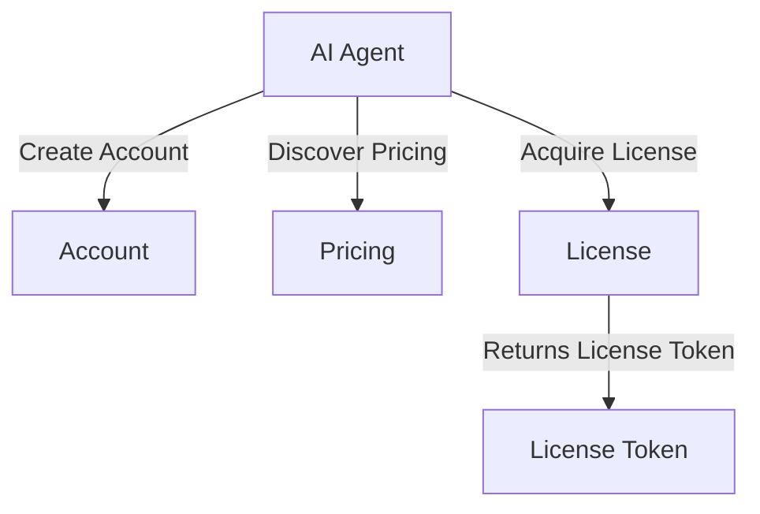
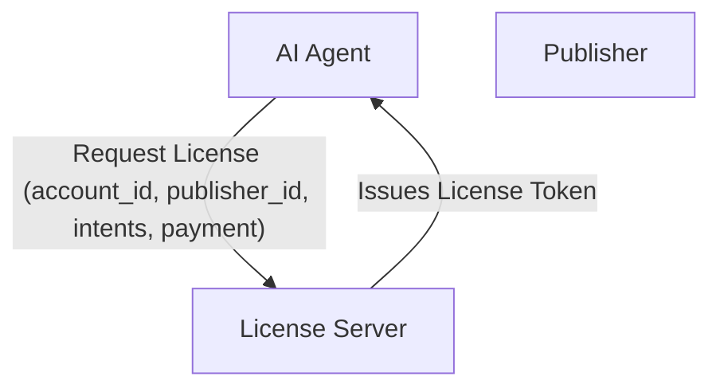
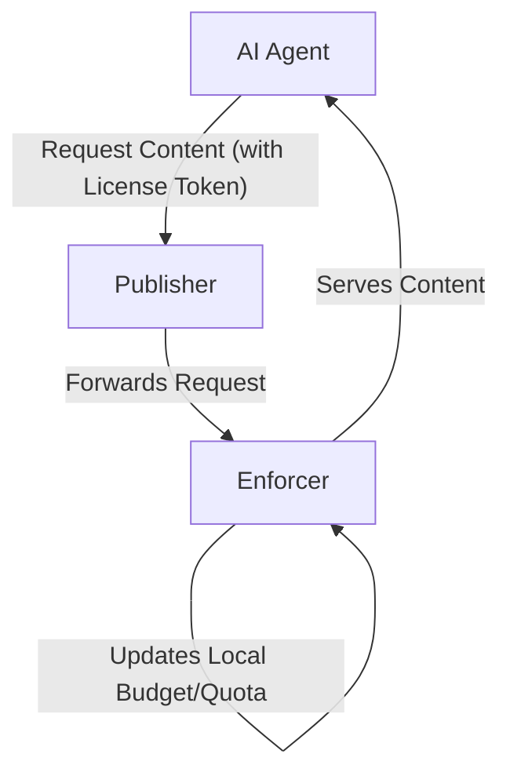
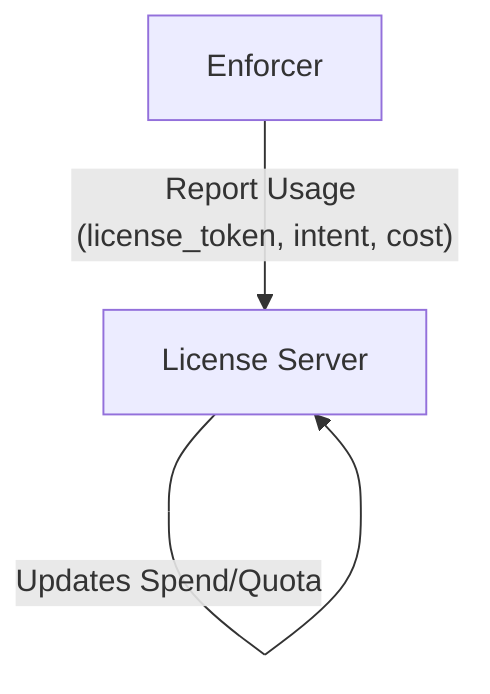

# License API Specification (Peek-Then-Pay)

This document defines the API for securely acquiring, validating, and reporting licenses for AI
access to publisher content. It is designed for use by enforcers (e.g., CDN/edge workers) and AI
agents, and supports flexible pricing, quota, and enforcement models.

**Roles:**

- AI agents/operators use the API to discover pricing and capabilities, create accounts, associate
  payment methods, acquire licenses, and access content in accordance with license terms. All
  tool/pricing configuration is managed in the license server and returned via the API.
- Enforcers use the API to report usage for content access.

---

## AI Agent/Operator Endpoints & Usage

This section covers endpoints and flows used by AI agents to discover pricing, create accounts,
acquire licenses, and manage payment methods.



## Endpoints

### 1. Discover Pricing & Tool Capabilities

**GET /pricing?publisher_id={publisher_id}&account_id={account_id}**

- Used by AI agents to discover all available pricing options for a publisher.
- The `account_id` may be provided to determine any custom pricing scheme for that AI agent account.
- May return different pricing for different accounts (e.g., discounts for smaller LLMs or preferred
  partners).
- Response includes all supported intents, quotas, path-based multipliers, and a `pricing_scheme_id`
  (ULID) for cache validation.

**Example Request:**

```
GET /pricing?publisher_id=01HQ2Z3Y4K5M6N7P8Q9R0S1T1X&account_id=01HQ2Z3Y4K5M6N7P8Q9R0S1T1Y
```

**Example Response:**

```json
{
  "id": "01HQ2Z3Y4K5M6N7P8Q9R0S1T2Y",
  "publisher_id": "01HQ2Z3Y4K5M6N7P8Q9R0S1T1X",
  "operator_id": "01HQ2Z3Y4K5M6N7P8Q9R0S1T1Y",
  "pricing_digest": "sha256:custom-discount",
  "currency": "USD",
  "cache_ttl_seconds": 3600,
  "intents": {
    "read": {
      "intent": "read",
      "price_cents": 1,
      "license_required": true,
      "enforcement_method": "tool_required"
    },
    "summarize": {
      "intent": "summarize",
      "price_cents": 2,
      "license_required": true,
      "enforcement_method": "tool_required",
      "model": {
        "id": "sum:gpt-4o-mini@v1",
        "provider": "openai",
        "name": "gpt-4o-mini",
        "version": "v1",
        "digest": "sha256:gpt4omini-digest-v1"
      }
    },
    "train": {
      "intent": "train",
      "price_cents": 5,
      "license_required": true,
      "enforcement_method": "tool_required"
    }
  },
  "quotas": {
    "burst_rps": 50,
    "max_license_duration_seconds": 3600
  }
}
```

### 2. Acquire License

**POST /licenses**

- AI agent requests a license for specific intents and enforcement method.

**Example Request (with payload):**

POST /licenses?publisher_id=01HQ2Z3Y4K5M6N7P8Q9R0S1T1X

```json
{
  "publisher_id": "01HQ2Z3Y4K5M6N7P8Q9R0S1T1X",
  "pricing_scheme_id": "01HQ2Z3Y4K5M6N7P8Q9R0S1T2Y",
  "intents": ["read"],
  "budget_cents": 1000
}
```

**Example Response:**

```json
{
  "license_id": "01HKQM8Z1A2B3C4D5E6F7G8H9J",
  "license_jwt": "eyJhbGciOiJSUzI1NiIsInR5cCI6IkpXVCIsImtpZCI6Im9wZXJhdG9yLWtleSJ9.eyJpc3MiOiJmZXRjaHJpZ2h0LWFwaSIsInN1YiI6IjAxSEtRTTdZOFg5WjJCM0M0RDVFNkY3RzhIIiwiYXVkIjoiMDFIS1FNN1k4WDlaYjNDNEQ1RTZGNyIsImV4cCI6MTY5NDQ1MzQwMCwiaWF0IjoxNjk0NDUyNTAwLCJsaWNlbnNlX2lkIjoiMDFIS1FNOFoxQTJCM0M0RDVFNkY3RzhIOUoiLCJwdWJsaXNoZXJfaWQiOiIwMUhLUU03WThYOVoyQjNDNEQ1RTZGN0c4SCIsInByaWNpbmdfc2NoZW1lX2lkIjoiZGVmYXVsdC1yZWFkLXN1bW1hcml6ZSIsInByaWNpbmdfc2NoZW1lX3R5cGUiOiJkZWZhdWx0IiwibGljZW5zZWVfaWQiOiIwMUhLUU03WThYOVoyQjNDNEQ1RTZGN0c4SCIsImludGVudHMiOlsicmVhZCIsInN1bW1hcml6ZSJdLCJidWRnZXRfY2VudHMiOjEwMDAsImlzc3VlZF9hdCI6IjIwMjQtMDktMTdUMTQ6MDg6MjBaIiwiZXhwaXJlc19hdCI6IjIwMjQtMDktMTdUMTQ6MjM6MjBaIiwibWV0YWRhdGEiOnsiY2xpZW50X3ZlcnNpb24iOiIxLjAuMCIsInNlc3Npb25faWQiOiJzZXNzX2FiYzEyMyJ9fQ.M8L2P9x1vC3nB7f8QhGjKlMnOpQrStUvWxYzAbCdEfGhIjKlMnOpQrStUvWxYzAbCdEfGhIjKlMnOpQrStUvWxYzAbCdEfGhIjKlMnOpQrStUvWxYzAbCdEfGhIjKlMnOpQrStUvWxYzAbCdEfGhIjKlMnOpQrStUvWxYzAbCdEfGhIjKlMnOpQrStUvWxYzAbCdEfGhIjKlMnOpQrStUvWxYzAbCdEfGhIjKlMnOpQrStUvWxYzAbCdEfGh",
  "expires_at": "2024-09-17T14:23:20Z"
}
```

**Example format of decoded JWT Payload:**

```json
{
  "iss": "fetchright-api",
  "sub": "01HKQM7Y8X9Z2B3C4D5E6F7G8H",
  "aud": "01HKQM7Y8X9Zb3C4D5E6F7",
  "exp": 1694453400,
  "iat": 1694452500,
  "license_id": "01HKQM8Z1A2B3C4D5E6F7G8H9J",
  "publisher_id": "01HQ2Z3Y4K5M6N7P8Q9R0S1T1X",
  "pricing_scheme_id": "01HQ2Z3Y4K5M6N7P8Q9R0S1T2Y",
  "pricing_scheme_type": "default",
  "licensee_id": "01HKQM7Y8X9Z2B3C4D5E6F7G8H",
  "intents": ["read", "summarize"],
  "budget_cents": 1000,
  "issued_at": "2024-09-17T14:08:20Z",
  "expires_at": "2024-09-17T14:23:20Z",
  "metadata": {
    "client_version": "1.0.0"
  }
}
```

---

## Enforcer Endpoints & Usage

### 1. Usage Reporting (Record)

**POST /usage/publisher/bulk**

- Enforcer reports usage after content is served to the AI agent.
- Supports robust reporting and credit management.

**Example Request (bulk reporting):**

```json
{
  "license_id": "01HKQM8Z1A2B3C4D5E6F7G8H9J",
  "usage_results": [
    {
      "reservation_id": "01HKQM9A1B2C3D4E5F6G7H8I9J",
      "license_id": "01HKQM8Z1A2B3C4D5E6F7G8H9J",
      "intent": "read",
      "amount_cents": 150,
      "path": "/api/v1/documents/123/content",
      "request_time": "2024-09-17T14:10:00Z",
      "resolve_time": "2024-09-17T14:10:02Z",
      "success": true,
      "metadata": {
        "document_size": "2048",
        "content_type": "application/pdf"
      }
    },
    {
      "reservation_id": "01HKQM9B2C3D4E5F6G7H8I9J0K",
      "license_id": "01HKQM8Z1A2B3C4D5E6F7G8H9J",
      "intent": "summarize",
      "amount_cents": 300,
      "path": "/api/v1/documents/123/summary",
      "request_time": "2024-09-17T14:10:05Z",
      "resolve_time": "2024-09-17T14:10:12Z",
      "success": true,
      "metadata": {
        "summary_length": "250",
        "processing_model": "gpt-4",
        "agent": "FetchRight-Summarizer/1.0.0"
      }
    }
  ],
  "metadata": {
    "publisher_version": "2.1.0"
  }
}
```

**Example Response:**

```json
{
  "status": "success",
  "data": {
    "usage_report_id": "01HKQM9D4E5F6G7H8I9J0K1L2M",
    "total_results": 2,
    "successful_results": 2,
    "failed_results": 0,
    "total_amount_cents": 450,
    "failures": undefined
  }
}
```

---

## Lease & Credit Management

- Budget should be reserved for the license duration and only consumed on confirmed usage.
- Unused budget should be returned to the operator’s budget at license expiry or exhaustion.

---

## Pricing Scheme IDs

- All pricing responses include a `pricing_scheme_id` field (ULID).
- Enforcers and AI agents/operators use the `pricing_scheme_id` to ensure they are using the correct
  pricing logic for spend calculations and compliance.
- A license may reference a custom pricing scheme, which overrides the general pricing for that
  publisher.

---

## Security

- All API calls (except pricing) should require authentication with a valid account.
- License acquisition and reporting endpoints must verify the caller’s identity and permissions.

## License Acquisition Flow



## License Usage & Enforcement Flow



## Usage Reporting Flow



_This document is the reference for the license API only. For peek.json manifest fields, see
`peek-manifest-fields.md`._
