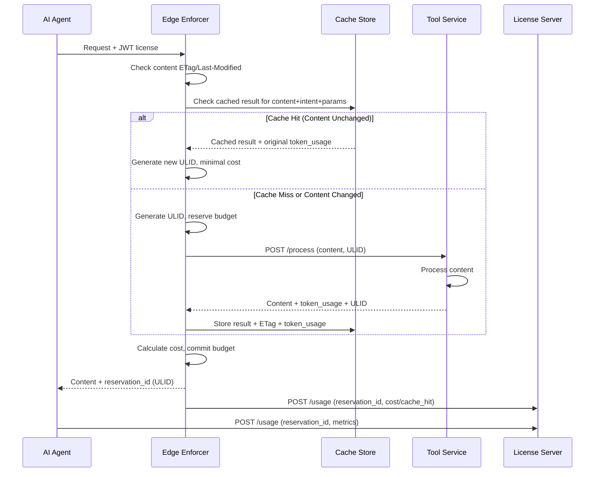
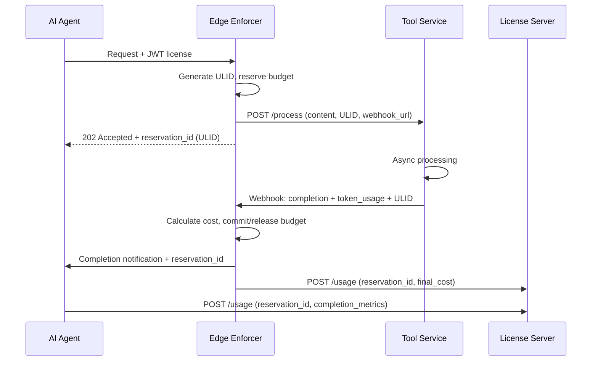

# Tool Service API Guide

**Informational guidelines for publishers implementing content transformation services**

This guide provides architectural patterns and implementation guidance for publishers who need to
handle `enforcement_method=tool_required` intents. Publishers can achieve content transformation
through:

- **In-house development** - Build custom transformation services using your preferred tech stack
- **SaaS solutions** - Integrate with third-party providers for summarization, embedding,
  translation, etc.
- **Hybrid approach** - Combine internal services for sensitive content with external APIs for
  standard transformations

## Composable Architecture & Implementation Flexibility

This specification supports **composable tooling structures** with clear separation of concerns:

### Third-Party (SaaS) Enforcers

When using **third-party enforcement services**, this API specification ensures interoperability
between the SaaS enforcer (JWT validation, budget management, usage reporting) and your
transformation services (content processing). The standardized API enables plug-and-play
compatibility across different enforcer and tooling providers.

**Implementation Guidelines:**

- **Standardized API**: Follow these patterns for interoperability with SaaS enforcers
- **Internal Only**: Never expose transformation services to public internet or AI agents directly
- **Token Reporting**: Report input/output token usage to enforcer (not costs or budgets)
- **No License Logic**: Enforcers handle all JWT validation, budget tracking, and billing

### Custom Publisher Enforcers

Publishers who **build their own enforcement infrastructure** have complete flexibility in how they
integrate with transformation services:

**Implementation Guidelines:**

- **Full Flexibility**: Use any integration pattern that fits your architecture
- **No API Constraints**: Internal interfaces can be optimized for your specific requirements
- **Direct Control**: Handle enforcement logic and content transformation coordination as needed
- **Composable Benefits**: Mix and match components (custom enforcer + SaaS tooling, or vice versa)

| Intent       | Input Tokens | Output Tokens | Processing Pattern                                   | Cache TTL       | Usage Context Fit           |
| ------------ | ------------ | ------------- | ---------------------------------------------------- | --------------- | --------------------------- |
| `read`       | N/A          | N/A           | **Bypass tool service** (`enforcement_method=trust`) | N/A             | All contexts                |
| `summarize`  | 1000-5000    | 100-500       | Synchronous LLM processing                           | 1-24 hours      | `immediate`, `session`      |
| `quote`      | 500-2000     | 50-200        | Text extraction + formatting                         | 1-24 hours      | `immediate`, `session`      |
| `embed`      | 500-2000     | Vector array  | Synchronous embedding model                          | 24 hours-7 days | `session`, `index`          |
| `rag_ingest` | 2000-10000   | 100-1000      | **Asynchronous** chunking + embedding                | 7-30 days       | `session`, `index`          |
| `analyze`    | 2000-8000    | 500-2000      | Complex LLM analysis                                 | 30+ days        | `train`, `distill`, `audit` |
| `translate`  | 1000-5000    | 1000-5000     | Language model processing                            | 1-24 hours      | `immediate`, `session`      |

**Cache TTL Strategy:**

- **Short TTL** (`immediate`, `session`): Content changes frequently, aggressive cache invalidation
- **Medium TTL** (`index`): Balance between cost savings and content freshness
- **Long TTL** (`train`, `distill`, `audit`): Static content analysis, maximum cost optimization

These services are never exposed directly to AI agents - all access is routed through enforcers that
handle license validation, budget management, and usage reporting.

## API Specification

The following patterns apply when using **third-party enforcers** that need standardized interfaces
for interoperability:

### Enforcement Method Integration

| Enforcement Method | Implementation           | Purpose & Use Cases                                                                                                                                                                                                                 |
| ------------------ | ------------------------ | ----------------------------------------------------------------------------------------------------------------------------------------------------------------------------------------------------------------------------------- |
| `trust`            | Direct content serving   | **Two scenarios**: (1) **AI Agent Processing** - agents receive raw content and run their own transformation pipelines, (2) **Publisher Flexibility** - publishers can license intents without implementing transformation services |
| `tool_required`    | Route to tooling service | Publisher-controlled content transformation before delivery to AI agents                                                                                                                                                            |

## Request/Response Interface

### Tool Service Request (from Enforcer)

**REST API Pattern:**

```typescript
POST /process
{
  content_url: "https://example.com/article",
  intent: "summarize",
  reservation_id: "01ARZ3NDEKTSV4RRFFQ69G5FAV", // ULID for tracking
  parameters?: {
    output_format: "json",
    max_length?: 500,
    // Intent-specific parameters only
  }
}
```

**MCP (Model Context Protocol) Pattern:**

```typescript
// Tool discovery via MCP
GET /mcp/tools -> ["summarize", "embed", "rag_ingest", ...]

// Tool execution via MCP
{
  method: "tools/call",
  params: {
    name: "summarize",
    arguments: {
      content_url: "https://example.com/article",
      reservation_id: "01ARZ3NDEKTSV4RRFFQ69G5FAV",
      max_length: 500
    }
  }
}
```

### Tool Service Response (to Enforcer)

**REST API Response:**

```typescript
HTTP/1.1 200 OK
{
  content: "...", // Processed content
  token_usage: {
    input_tokens: 1500,
    output_tokens: 300
  },
  processing_time_ms: 1200,
  reservation_id: "01ARZ3NDEKTSV4RRFFQ69G5FAV" // Echo back for correlation
}
```

**MCP Response:**

```typescript
{
  content: [{
    type: "text",
    text: "..." // Processed content
  }],
  _meta: {
    token_usage: {
      input_tokens: 1500,
      output_tokens: 300
    },
    processing_time_ms: 1200,
    reservation_id: "01ARZ3NDEKTSV4RRFFQ69G5FAV"
  }
}
```

### What Tool Services SHOULD NOT Handle

- ❌ License validation or JWT processing
- ❌ Budget management or cost calculations
- ❌ Agent identity or quota enforcement
- ❌ Usage context or retention policies (irrelevant to transformation)
- ❌ Usage reporting to license server (enforcer's responsibility)

## Processing Flow & Budget Integration

### Synchronous Processing (with Caching)



### Asynchronous Processing (`rag_ingest`, etc.)



## Configuration Examples

### Enforcer Configuration

**Static Configuration (REST):**

```typescript
// Enforcer config for tool routing
{
  tool_services: {
    "summarize": "https://internal.tools/summarize",
    "embed": "https://internal.tools/embed",
    "rag_ingest": "https://saas-provider.com/rag",
    "analyze": "https://internal.tools/analyze"
  }
}
```

**Dynamic Discovery (MCP):**

```typescript
// Enforcer discovers available tools
{
  mcp_endpoint: "https://internal.tools/mcp",
  // Enforcer queries /mcp/tools for available intents
  // Routes based on dynamic tool discovery
}
```

### Deployment Options

- **Publisher-Managed**: Internal services behind private networks
- **SaaS Integration**: Third-party services (OpenAI, Anthropic, etc.) with API key management
- **Hybrid**: Mix of internal and external services based on intent type
- **MCP-Based**: Dynamic tool discovery and execution via Model Context Protocol

### Performance Requirements

- **Synchronous intents**: < 30 second response time
- **Asynchronous intents**: Webhook callback within 5 minutes of completion
- **Token reporting**: Must be accurate for billing - measure actual consumption
- **MCP compatibility**: Support both REST endpoints and MCP tool discovery/execution

### Security Considerations

- **No public exposure**: Tool services should only accept enforcer requests
- **Pre-authenticated**: Enforcer handles all authentication/authorization
- **Content isolation**: Process each request independently without cross-contamination

### Caching & Cost Optimization

**Content Change Detection:**

```typescript
// Enforcer checks content freshness before calling tooling
const content_headers = await HEAD(content_url);
const cache_key = `${intent}:${content_url}:${JSON.stringify(parameters)}`;
const cached_etag = await getCache(cache_key + ':etag');

if (content_headers.etag === cached_etag) {
  // Content unchanged - return cached result
  const cached_response = await getCache(cache_key);
  return {
    ...cached_response,
    reservation_id: generateULID(), // New ULID for billing
  };
}
```

**Cache Strategy:**

- **Cache Key**: `intent:content_url:parameters_hash`
- **Cache Validation**: ETag or Last-Modified header comparison
- **Cache Duration**: Based on usage context - `immediate` (short), `index` (longer)
- **Cost Savings**: Avoid redundant tooling calls for unchanged content
- **Fresh Reservation IDs**: Generate new ULIDs even for cached responses for billing accuracy

## Related Documentation

- **[Edge Enforcement Guide](recommended-edge-enforcement-guide.md)** – Complete enforcer
  implementation patterns
- **[License API](license-api.md)** – Bilateral reporting and budget management
- **[Usage Context Guide](usage-context-guide.md)** – Understanding usage types and pricing
  implications
- **[Normative Intent Definitions](normative-intent-definitions.md)** – Standard intent
  specifications
