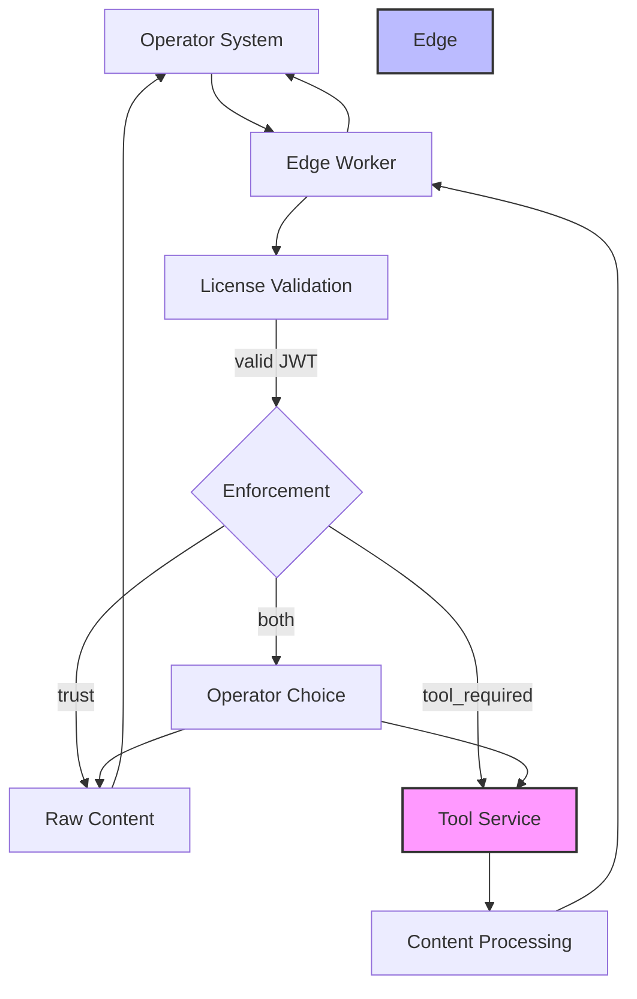
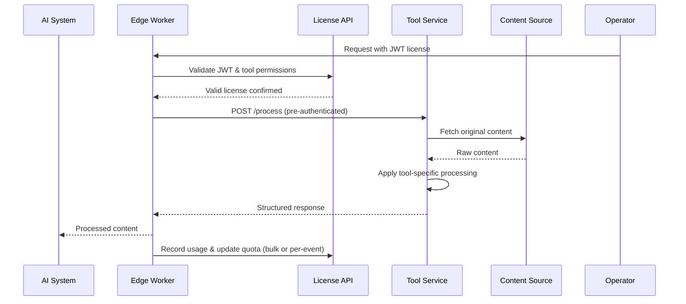

# Tool Service Implementation Guide

**⚠️ IMPORTANT: Tool services should never be exposed directly to AI agents. All access is routed
through enforcers that handle license validation, quota, and payment logic. Tool services trust the
enforcer to validate licensing and quota.**

Tool services provide content processing for specific tools when publishers use `tool_required` or
`both` enforcement methods. These services receive pre-authenticated requests from enforcers and can
be internal, SaaS, or hybrid implementations. Tool services are agnostic to licensing, payment, and
quota—they simply process content and return results. All licensing, quota, and payment logic is
handled by the enforcer, which validates JWT licenses and enforces quotas before invoking the tool
service.

> **Note:** If a publisher uses a SaaS tool service that incurs additional costs, those costs should
> be reflected in the pricing passed on to the AI agent for a license. The enforcer abstracts all
> licensing, quota, and payment logic, ensuring tool services only focus on content processing.

## 🏗️ Architecture Overview



**Key Principles:**

- 🔒 **Tool services are never exposed directly** to AI agents/operators or public internet
- 🛡️ **Edge workers (enforcers) handle all license validation, quota, and payment logic**
- 🔄 **Flexible implementation** - can be internal, SaaS, or hybrid solutions
- 🧩 **Tool services are agnostic to licensing and payment**
- 💸 **SaaS tool costs are reflected in license pricing for AI agents**

## 🎯 Separation of Concerns

### What Tool Services Receive

Tool services should only receive what they need for content processing:

**✅ Required Information:**

- **Content URL**: The source content to process
- **Output Format**: Desired response format (json, markdown, etc.)
- **Tool Parameters**: Processing-specific settings

**❌ NOT Included:**

- License information (handled by edge worker)
- AI agent/operator identity or quotas
- Pricing or billing details
- Original request headers from AI agents

### What Edge Workers Handle

- License validation and quota management (JWT assertion-only)
- Bot detection and request authentication
- Cost calculation and usage recording
- Request routing to appropriate tool services
- Response formatting for AI agents
- Abstracting all licensing, quota, and payment logic from tool services

This separation ensures tool services can focus purely on content processing while edge workers
handle all business logic, security, and compliance requirements.

## 🌊 Edge-to-Service Flow



## 🔄 Tool Processing Pipeline

```mermaid
flowchart TD
  Raw[Raw Content] --> ToolType{Tool Type}
  ToolType -->|peek_metadata| Preview[Extract Preview]
  ToolType -->|summarize| Summary[AI Summarization]
  ToolType -->|quote| Quotes[Extract Quotable Segments]
  ToolType -->|embed| Embeddings[Generate Embeddings]
  ToolType -->|rag_ingest| RAG[Chunk & Embed for RAG]
  ToolType -.->|read bypasses tool service| Direct[Direct HTTP Access]
  ToolType -->|train| Training[Training Data Format]
  ToolType -->|qa| QA[Structured QA Pair Format]
  ToolType -->|translate| Translate[Translate corpora]
  ToolType -->|analyze| Analyze[Agentic analysis of source data]
  ToolType -->|search| Search[Perform search over embedded content]
  Preview --> ReturnPreview[Return Preview]
  Summary --> ReturnSummary[Return Summary]
  Quotes --> ReturnQuotes[Return Quotes with Attribution]
  Embeddings --> ReturnEmbeddings[Return Vector Embeddings]
  RAG --> ReturnRAG[Return RAG-ready Chunks]
  Direct --> ReturnFull[Return Full Content]
  Training --> ReturnTraining[Return Training-ready Data]
  QA --> ReturnQA[Return Structured QA Pairs]
  Translate --> ReturnTranslate[Return Translated+source Data]
  Analyze --> ReturnAnalyze[Return JSON structured annotations (sentiment, entities, etc)]
  Search --> ReturnSearch[Return Semantic search over embedded content]
```

**Note:** License-related errors (402, 403, 429) are handled by edge workers before requests reach
tool services.
