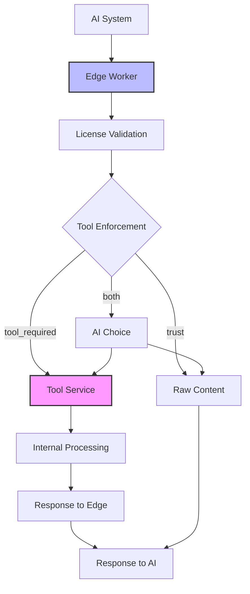
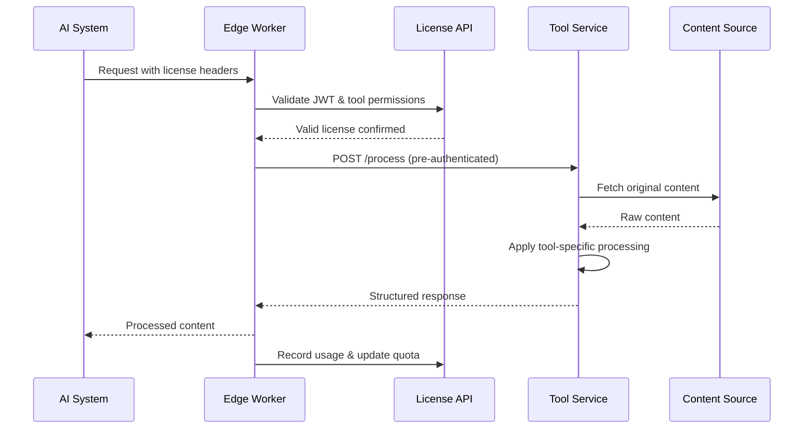
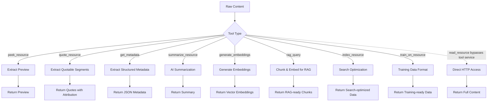

# Tool Service Implementation Guide

**⚠️ IMPORTANT: Tool services are never exposed directly to AI systems. All access is routed through CDN/Edge Workers that handle license validation.**

Tool services provide content processing for specific tools when publishers use `"tool_required"` or `"both"` enforcement methods. These services receive pre-authenticated requests from edge workers and can be internal, SaaS, or hybrid implementations.

## 🏗️ Architecture Overview



**Key Principles:**
- 🔒 **Tool services are never exposed directly** to AI systems or public internet
- 🛡️ **Edge workers handle all license validation** - services receive trusted requests
- 🔄 **Flexible implementation** - can be internal, SaaS, or hybrid solutions

## 🎯 Separation of Concerns

### What Tool Services Receive
Tool services should only receive what they need for content processing:

**✅ Required Information:**
- **Content URL**: The source content to process
- **Output Format**: Desired response format (json, markdown, etc.)
- **Tool Parameters**: Processing-specific settings
- **Authentication**: Edge worker credentials to use the service

**❌ NOT Included:**
- License information (handled by edge worker)
- AI system identity or quotas
- Pricing or billing details
- Original request headers from AI systems

### What Edge Workers Handle
- License validation and quota management
- Bot detection and request authentication  
- Cost calculation and usage recording
- Request routing to appropriate tool services
- Response formatting for AI systems

This separation ensures tool services can focus purely on content processing while edge workers handle all business logic, security, and compliance requirements.

## 🌊 Edge-to-Service Flow



## 🔄 Tool Processing Pipeline



## 🔧 Edge Worker Configuration

Edge workers maintain internal configuration that maps peek.json tools to service implementations:

```javascript
// Edge worker environment/configuration (not in peek.json)
const TOOL_SERVICES = {
  "summarize_resource": {
    "endpoint": "http://internal-ai-service:8080/summarize",
    "auth": "Bearer ${INTERNAL_AI_TOKEN}",
    "timeout": 30000
  },
  "generate_embeddings": {
    "endpoint": "http://embedding-service:3000/embed", 
    "auth": "Bearer ${EMBEDDING_TOKEN}",
    "timeout": 15000
  },
  "get_metadata": {
    "endpoint": "http://localhost:9000/extract-metadata",
    "auth": "none",
    "timeout": 5000
  }
};
```

**Security Benefits:**
- ✅ **Internal endpoints** never exposed in peek.json
- ✅ **Tool services** don't need license validation logic
- ✅ **Publishers control** routing without exposing implementation
- ✅ **Easy service changes** without updating public manifests

## Request Format

### POST {service_endpoint}

**⚠️ These are internal API calls from edge workers to tool services - not directly accessible by AI systems.**

Edge workers send pre-authenticated requests to tool services with only the information needed for content processing:

**Headers (from edge worker):**
```
Content-Type: application/json
Authorization: Bearer <internal_service_token>
```

**Body (sent by edge worker):**
```json
{
  "url": "https://technews.com/articles/ai-ethics-2025",
  "output_format": "json",
  "tool_params": {
    "max_summary_length": 500,
    "include_key_points": true,
    "attribution_required": true
  }
}
```

## Service Implementation Examples

### POST /internal/summarize
**Internal service - not publicly accessible**

```javascript
// Example service implementation (no license validation needed!)
app.post('/internal/summarize', async (req, res) => {
  const { url, output_format, tool_params } = req.body;
  
  // Edge worker already validated license - process the request
  const content = await fetchContent(url);
  const summary = await generateSummary(content, output_format, tool_params);
  
  res.json({
    processed_content: {
      summary: summary,
      format: output_format || 'markdown',
      key_points: tool_params?.include_key_points ? extractKeyPoints(content) : undefined
    },
    source_url: url,
    processing_time_ms: Date.now() - start,
    content_length: content.length
  });
});
```

**Response:**
```json
{
  "processed_content": {
    "summary": "## Key Points\n\n- AI ethics frameworks are evolving\n- New regulations proposed for 2025",
    "format": "markdown",
    "key_points": ["AI ethics frameworks are evolving", "New regulations proposed for 2025"]
  },
  "source_url": "https://technews.com/articles/ai-ethics-2025",
  "processing_time_ms": 1250,
  "content_length": 1024
}
```

## Additional Service Examples

### POST /internal/embeddings
**Internal service for vector embeddings**

```javascript
app.post('/internal/embeddings', async (req, res) => {
  const { url, output_format, tool_params } = req.body;
  
  const content = await fetchContent(url);
  const embeddings = await generateEmbeddings(content, tool_params);
  
  res.json({
    processed_content: {
      embeddings: embeddings,
      model: tool_params?.model || "text-embedding-3-large",
      dimensions: embeddings.length,
      format: "embeddings"
    },
    source_url: url,
    processing_time_ms: Date.now() - start,
    content_length: content.length
  });
});
```

### POST /internal/metadata
**Internal service for content metadata**

```javascript
app.post('/internal/metadata', async (req, res) => {
  const { url, output_format, tool_params } = req.body;
  
  const content = await fetchContent(url);
  const metadata = await extractMetadata(content, tool_params);
  
  res.json({
    processed_content: {
      title: metadata.title,
      author: metadata.author,
      publish_date: metadata.publishDate,
      categories: metadata.categories,
      word_count: metadata.wordCount,
      reading_time: `${Math.ceil(metadata.wordCount / 200)} minutes`,
      format: "json"
    },
    source_url: url,
    processing_time_ms: Date.now() - start,
    content_length: content.length
  });
});
```
## Trust vs Tool-Required Access

### Trust (Raw Content)
When enforcement_method includes "trust", AI systems receive raw content directly through the edge worker:

```http
GET /articles/ai-ethics-2025 HTTP/1.1
Host: technews.com  
Authorization: Bearer <license_jwt>
X-Peek-Tool: read_resource
```

**Edge worker response:** Raw HTML/content served directly

### Tool-Required (Processed Content)  
When enforcement_method includes "tool_required", edge workers route to service processing:

```javascript
// Edge worker routes to tool service
const response = await fetch('http://internal-service:8080/summarize', {
  method: 'POST',
  headers: { 'Authorization': 'Bearer internal-token' },
  body: JSON.stringify({ 
    url: originalUrl, 
    output_format: 'json',
    tool_params: { max_summary_length: 500 }
  })
});
```

**AI system receives:** Processed content from tool service

### Both (AI Choice)
When enforcement_method is "both", AI systems can specify preference:

```http
GET /articles/ai-ethics-2025 HTTP/1.1
Host: technews.com
Authorization: Bearer <license_jwt>
X-Peek-Tool: summarize_resource
X-Peek-Mode: trust
```

Edge worker honors the preference when available.

## Error Handling

Since tool services receive pre-authenticated requests from edge workers, error handling focuses on processing issues rather than license validation:

### 500 Internal Server Error
```json
{
  "error": "processing_failed", 
  "message": "Content summarization service unavailable",
  "retry_after": 60
}
```

### 422 Unprocessable Entity
```json
{
  "error": "content_unsupported",
  "message": "Content type 'application/pdf' not supported for this tool"
}
```

### 503 Service Unavailable  
```json
{
  "error": "service_overloaded",
  "message": "Processing capacity exceeded, try again later",
  "retry_after": 300
}
```

**Note:** License-related errors (402, 403, 429) are handled by edge workers before requests reach tool services.
