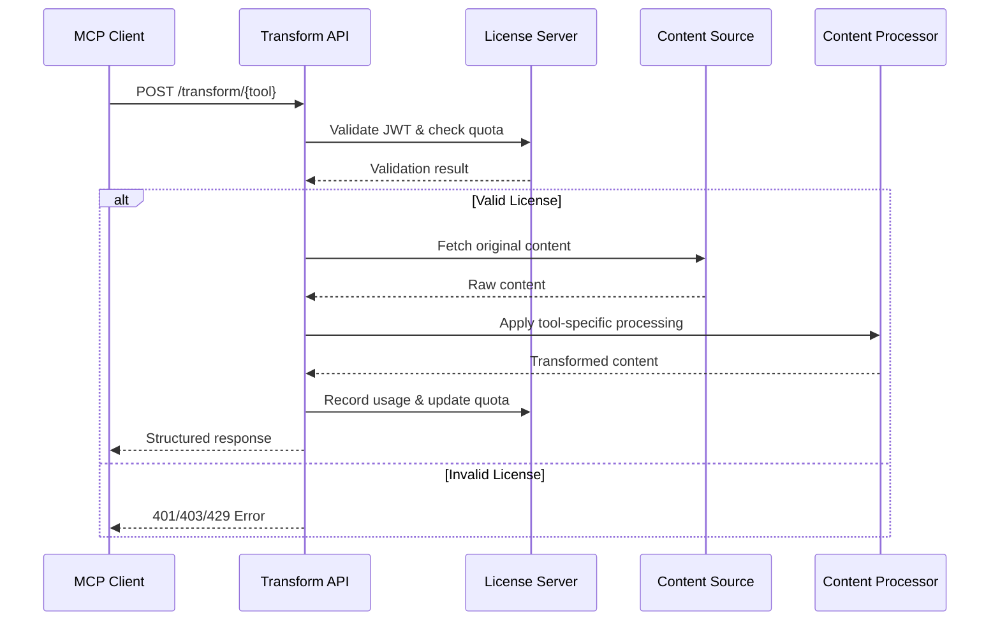
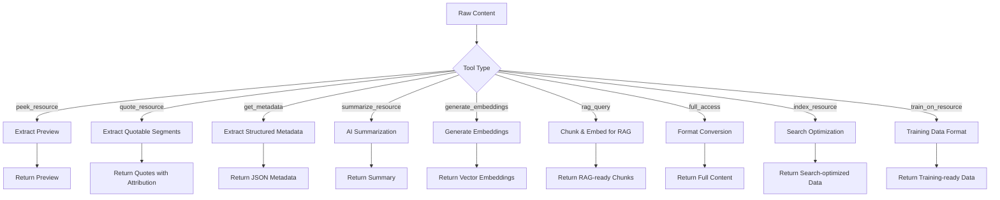

# Transform API Specification

The `transform_api` endpoint provides standardized content transformation for each supported MCP tool. This centralizes content processing and ensures consistent output formats across all tools.

## 🌊 Transform API Flow



## 🔄 Tool Processing Pipeline



## Base Endpoint

The transform API uses the base URL specified in the `transform_api` field of the peek.json manifest.

Example: `https://api.technews.com/peek/transform`

## Request Format

### POST {transform_api}/{tool}

All tools follow the same URL pattern: `{base_transform_api_url}/{tool_name}`

**Concrete Examples:**
- `POST https://api.technews.com/peek/transform/summarize_resource`
- `POST https://api.technews.com/peek/transform/peek_resource`
- `POST https://api.technews.com/peek/transform/train_on_resource`

Where:
- `https://api.technews.com/peek/transform` is the `transform_api` base URL from peek.json
- `summarize_resource`, `peek_resource`, etc. are the tool names

**Headers:**
```
Authorization: Bearer <license_jwt>
Content-Type: application/json
```

**Body:**
```json
{
  "url": "https://technews.com/articles/ai-ethics-2025",
  "output_format": "json"
}
```

## Tool-Specific Endpoints

### POST https://api.technews.com/peek/transform/peek_resource
Returns a brief preview of the content (first few sentences, title, etc.)

**Response:**
```json
{
  "title": "AI Ethics in 2025: A New Framework",
  "preview": "As artificial intelligence continues to evolve...",
  "format": "plaintext"
}
```

### POST https://api.technews.com/peek/transform/quote_resource
Returns quotable excerpts with proper attribution formatting

**Response:**
```json
{
  "quotes": [
    {
      "text": "AI systems must be transparent and accountable",
      "context": "discussing regulatory frameworks",
      "attribution": "Dr. Smith, AI Ethics in 2025, TechNews Daily"
    }
  ],
  "format": "plaintext"
}
```

### POST https://api.technews.com/peek/transform/get_metadata
Returns structured metadata about the content

**Response:**
```json
{
  "title": "AI Ethics in 2025: A New Framework",
  "author": "Dr. Jane Smith",
  "publish_date": "2025-08-01",
  "categories": ["AI", "Ethics", "Technology"],
  "word_count": 1250,
  "reading_time": "5 minutes",
  "format": "json"
}
```

### POST https://api.technews.com/peek/transform/summarize_resource
Returns AI-generated summary in requested format

**Response (markdown):**
```json
{
  "summary": "## Key Points\n\n- AI ethics frameworks are evolving\n- New regulations proposed for 2025\n- Industry adoption challenges remain",
  "format": "markdown",
  "confidence_score": 0.95
}
```

### POST https://api.technews.com/peek/transform/generate_embeddings
Returns vector embeddings of the content

**Response:**
```json
{
  "embeddings": [0.1234, -0.5678, 0.9012, ...],
  "model": "text-embedding-3-large",
  "dimensions": 3072,
  "format": "embeddings"
}
```

### POST https://api.technews.com/peek/transform/rag_query
Returns content optimized for RAG systems

**Response:**
```json
{
  "chunks": [
    {
      "text": "AI ethics frameworks are becoming...",
      "metadata": {"section": "introduction", "importance": 0.9},
      "embedding": [0.1234, -0.5678, ...]
    }
  ],
  "document_metadata": {
    "title": "AI Ethics in 2025",
    "source": "technews.com",
    "reliability_score": 0.95
  },
  "format": "json"
}
```

### POST https://api.technews.com/peek/transform/full_access
Returns complete content in requested format

**Response (markdown):**
```json
{
  "content": "# AI Ethics in 2025: A New Framework\n\nBy Dr. Jane Smith...",
  "format": "markdown",
  "original_format": "html",
  "metadata": {
    "conversion_quality": 0.98,
    "elements_preserved": ["headings", "paragraphs", "links"]
  }
}
```

### POST https://api.technews.com/peek/transform/index_resource
Returns search-optimized structured data

**Response:**
```json
{
  "title": "AI Ethics in 2025: A New Framework",
  "content": "Clean content without navigation...",
  "keywords": ["AI", "ethics", "framework", "regulation"],
  "entities": [
    {"text": "Dr. Jane Smith", "type": "PERSON"},
    {"text": "2025", "type": "DATE"}
  ],
  "search_metadata": {
    "quality_score": 0.95,
    "content_type": "article",
    "language": "en"
  },
  "format": "json"
}
```

### POST https://api.technews.com/peek/transform/train_on_resource
Returns content formatted for ML training

**Response:**
```json
{
  "text": "AI ethics frameworks are becoming increasingly important...",
  "labels": {
    "domain": "technology",
    "content_type": "news_article",
    "quality_score": 0.95,
    "expertise_level": "intermediate"
  },
  "training_metadata": {
    "source_quality": "high",
    "factual_accuracy": 0.98,
    "bias_score": 0.1
  },
  "format": "json"
}
```

## Error Responses

### 402 Payment Required
```json
{
  "error": "license_required",
  "message": "This tool requires a valid license",
  "license_url": "https://api.technews.com/peek/license"
}
```

### 403 Forbidden
```json
{
  "error": "tool_not_allowed",
  "message": "The 'train_on_resource' tool is not permitted for this content"
}
```

### 429 Rate Limited
```json
{
  "error": "rate_limit_exceeded",
  "message": "Rate limit exceeded for tool 'summarize_resource'",
  "retry_after": 3600
}
```
