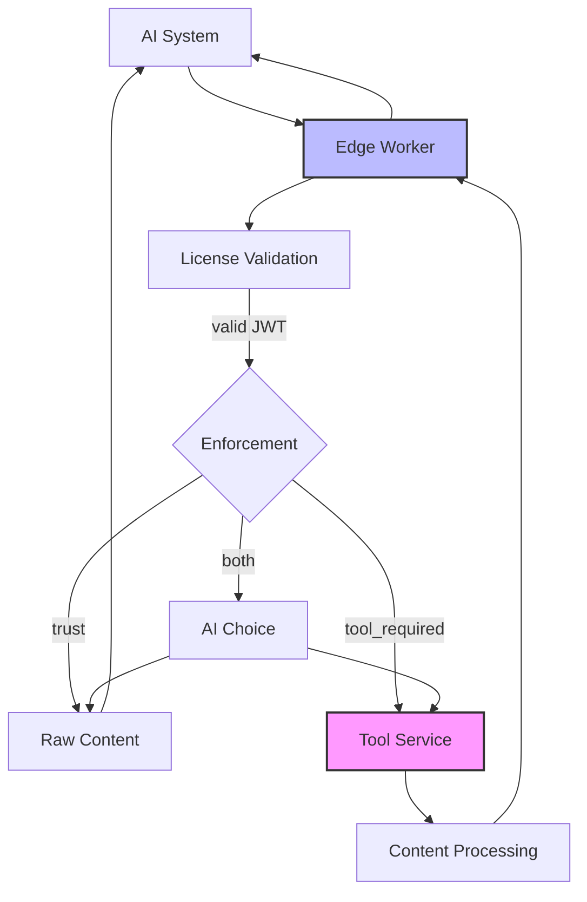
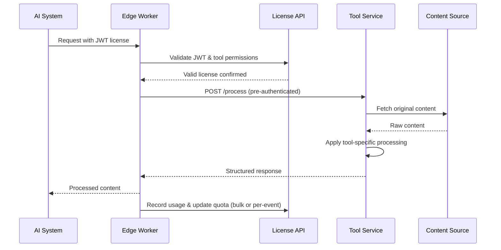
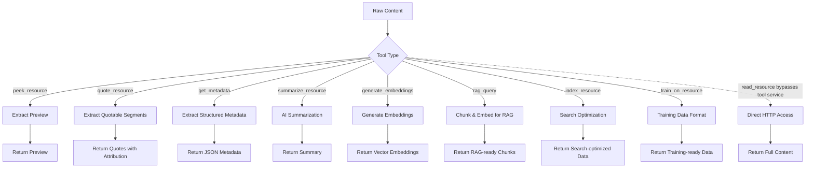

# Tool Service Implementation Guide

**⚠️ IMPORTANT: Tool services are never exposed directly to AI agents. All access is routed through CDN/Edge Workers (enforcers) that handle license validation, quota, and payment logic. Tool services are assertion-only: they trust the edge worker to enforce licensing and quota.**

Tool services provide content processing for specific tools when publishers use `tool_required` or `both` enforcement methods. These services receive pre-authenticated requests from edge workers and can be internal, SaaS, or hybrid implementations. Tool services are agnostic to licensing, payment, and quota—they simply process content and return results. All licensing, quota, and payment logic is handled by the edge worker, which validates JWT licenses and enforces quotas before invoking the tool service.

> **Note:** If a publisher uses a SaaS tool service that incurs additional costs, those costs will be reflected in the pricing passed on to the AI agent for a license. The enforcer abstracts all licensing, quota, and payment logic, ensuring tool services only focus on content processing.

## 🏗️ Architecture Overview



**Key Principles:**

- 🔒 **Tool services are never exposed directly** to AI agents or public internet
- 🛡️ **Edge workers (enforcers) handle all license validation, quota, and payment logic**
- 🔄 **Flexible implementation** - can be internal, SaaS, or hybrid solutions
- 🧩 **Tool services are agnostic to licensing and payment**
- 💸 **SaaS tool costs are reflected in license pricing for AI agents**

## 🎯 Separation of Concerns

### What Tool Services Receive

Tool services should only receive what they need for content processing:

**✅ Required Information:**

- **Content URL**: The source content to process
- **Output Format**: Desired response format (json, markdown, etc.)
- **Tool Parameters**: Processing-specific settings
- **Authentication**: Edge worker credentials to use the service

**❌ NOT Included:**

- License information (handled by edge worker)
- AI agent identity or quotas
- Pricing or billing details
- Original request headers from AI agents

### What Edge Workers Handle

- License validation and quota management (JWT assertion-only)
- Bot detection and request authentication
- Cost calculation and usage recording
- Request routing to appropriate tool services
- Response formatting for AI agents
- Abstracting all licensing, quota, and payment logic from tool services

This separation ensures tool services can focus purely on content processing while edge workers handle all business logic, security, and compliance requirements.

## 🌊 Edge-to-Service Flow



## 🔄 Tool Processing Pipeline



## 🔧 Edge Worker Configuration

Edge workers maintain internal configuration that maps peek.json tools to service implementations, using the following TypeScript interfaces:

```typescript
import { ToolServiceConfig, ToolConfig } from 'peek-types';

const toolServiceConfig: ToolServiceConfig = {
  tools: {
    summarize_resource: {
      provider: 'internal',
      baseUrl: 'http://internal-ai-service:8080',
      path: '/summarize',
      method: 'POST',
      auth: { type: 'bearer', credentials: 'INTERNAL_AI_TOKEN' },
      supportedOutputFormats: ['json', 'markdown'],
      timeout: 30000,
    },
    generate_embeddings: {
      provider: 'internal',
      baseUrl: 'http://embedding-service:3000',
      path: '/embed',
      method: 'POST',
      auth: { type: 'bearer', credentials: 'EMBEDDING_TOKEN' },
      supportedOutputFormats: ['embeddings'],
      timeout: 15000,
    },
    get_metadata: {
      provider: 'internal',
      baseUrl: 'http://localhost:9000',
      path: '/extract-metadata',
      method: 'POST',
      auth: { type: 'none', credentials: '' },
      supportedOutputFormats: ['json'],
      timeout: 5000,
    },
  },
  circuitBreaker: {
    failureThreshold: 5,
    recoveryTimeMs: 60000,
  },
};
```

**Security Benefits:**

- ✅ **Internal endpoints** never exposed in peek.json
- ✅ **Tool services** don't need license validation logic
- ✅ **Publishers control** routing without exposing implementation
- ✅ **Easy service changes** without updating public manifests

## Request Format

### POST {service_endpoint}

**⚠️ These are internal API calls from edge workers to tool services - not directly accessible by AI systems.**

Edge workers send pre-authenticated requests to tool services with only the information needed for content processing:

**Headers (from edge worker):**

```
Content-Type: application/json
Authorization: Bearer <internal_service_token>
```

**Body (sent by edge worker):**

```json
{
  "url": "https://technews.com/articles/ai-ethics-2025",
  "output_format": "json",
  "tool_params": {
    "max_summary_length": 500,
    "include_key_points": true,
    "attribution_required": true
  }
}
```

## Service Implementation Examples

### POST /internal/summarize

**Internal service - not publicly accessible**

```typescript
// Example service implementation (no license validation needed!)
app.post('/internal/summarize', async (req, res) => {
  const { url, output_format, tool_params } = req.body;
  // Edge worker already validated license - process the request
  const content = await fetchContent(url);
  const summary = await generateSummary(content, output_format, tool_params);
  res.json({
    processed_content: {
      summary: summary,
      format: output_format || 'markdown',
      key_points: tool_params?.include_key_points ? extractKeyPoints(content) : undefined,
    },
    source_url: url,
    processing_time_ms: Date.now() - start,
    content_length: content.length,
  });
});
```

**Response:**

```json
{
  "processed_content": {
    "summary": "## Key Points\n\n- AI ethics frameworks are evolving\n- New regulations proposed for 2025",
    "format": "markdown",
    "key_points": ["AI ethics frameworks are evolving", "New regulations proposed for 2025"]
  },
  "source_url": "https://technews.com/articles/ai-ethics-2025",
  "processing_time_ms": 1250,
  "content_length": 1024
}
```

## Additional Service Examples

### POST /internal/embeddings

**Internal service for vector embeddings**

```typescript
app.post('/internal/embeddings', async (req, res) => {
  const { url, output_format, tool_params } = req.body;
  const content = await fetchContent(url);
  const embeddings = await generateEmbeddings(content, tool_params);
  res.json({
    processed_content: {
      embeddings: embeddings,
      model: tool_params?.model || 'text-embedding-3-large',
      dimensions: embeddings.length,
      format: 'embeddings',
    },
    source_url: url,
    processing_time_ms: Date.now() - start,
    content_length: content.length,
  });
});
```

### POST /internal/metadata

**Internal service for content metadata**

```typescript
app.post('/internal/metadata', async (req, res) => {
  const { url, output_format, tool_params } = req.body;
  const content = await fetchContent(url);
  const metadata = await extractMetadata(content, tool_params);
  res.json({
    processed_content: {
      title: metadata.title,
      author: metadata.author,
      publish_date: metadata.publishDate,
      categories: metadata.categories,
      word_count: metadata.wordCount,
      reading_time: `${Math.ceil(metadata.wordCount / 200)} minutes`,
      format: 'json',
    },
    source_url: url,
    processing_time_ms: Date.now() - start,
    content_length: content.length,
  });
});
```

## Trust vs Tool-Required Access

### Trust (Raw Content)

When enforcement_method includes "trust", AI systems receive raw content directly through the edge worker:

```http
GET /articles/ai-ethics-2025 HTTP/1.1
Host: technews.com
Authorization: Bearer <license_jwt>
X-Peek-Tool: read_resource
```

**Edge worker response:** Raw HTML/content served directly

### Tool-Required (Processed Content)

When enforcement_method includes "tool_required", edge workers route to service processing:

```typescript
// Edge worker routes to tool service
const response = await fetch('http://internal-service:8080/summarize', {
  method: 'POST',
  headers: { Authorization: 'Bearer internal-token' },
  body: JSON.stringify({
    url: originalUrl,
    output_format: 'json',
    tool_params: { max_summary_length: 500 },
  }),
});
```

**AI system receives:** Processed content from tool service

### Both (AI Choice)

When enforcement_method is "both", AI systems can specify preference:

```http
GET /articles/ai-ethics-2025 HTTP/1.1
Host: technews.com
Authorization: Bearer <license_jwt>
X-Peek-Tool: summarize_resource
X-Peek-Mode: trust
```

Edge worker honors the preference when available.

## Error Handling

Since tool services receive pre-authenticated requests from edge workers, error handling focuses on processing issues rather than license validation:

### 500 Internal Server Error

```json
{
  "error": "processing_failed",
  "message": "Content summarization service unavailable",
  "retry_after": 60
}
```

### 422 Unprocessable Entity

```json
{
  "error": "content_unsupported",
  "message": "Content type 'application/pdf' not supported for this tool"
}
```

### 503 Service Unavailable

```json
{
  "error": "service_overloaded",
  "message": "Processing capacity exceeded, try again later",
  "retry_after": 300
}
```

**Note:** License-related errors (402, 403, 429) are handled by edge workers before requests reach tool services.
